## numpy

|      |                        |
| ---- | ---------------------- |
|      | np.logspace(0,2,num=5) |
|      |                        |
|      |                        |
|      |                        |
|      |                        |

'source C:/Users/qiuzhaojun/Desktop/数据库表实例构建/dump/craft_alarm_info.sql	source C:/Users/qiuzhaojun/Desktop/数据库表实例构建/dump/craft_station_info.sql	'

## pandas

| 解释 | 函数 |
| :------------: | :--------------------: |
| 列中值统一减去 | dataframe.col2 - value |
| 绝对值、平均值 | dataframe.col.**abs( )**           **mean()** |
| 统计数值个数 | dataframe.col.**value_counts( )** |
| 列中值相减 | dataframe.col1 - dataframe.col2 |
| 排序 | dataframe.col.**sort_index( )** |
| 随机选择数据、洗牌 | dataframe.**sample( )** |
| 替换 | dataframe.col.**replace**("/"," ") |
| 切片 | dataframe.col.**iloc**[ : ] |
| 删除行/列 | dataframe.**drop**( "col", axis=1) |
| 调用函数 | dataframe.col.apply( ) |
|      表格形状      |              dataframe.**shape**              |
|     返回非空值的series     | pandas.**notnull**(dataframe.col) |
| 列出列表中不同值 | dataframe.col.**unique( )** |
| 调用函数 | dataframe.col.**apply**(lambda x: x.split(",")) |
| 分组函数 | dataframe.**groupby**(col) |
| 聚合函数 | dataframe.**groupby**(col).**agg**({'col2':"median",'col3':"mean"}) |
| transfrom聚合函数 | data['avg_salary'] = data.groupby('company')['salary'].**transform**('mean') |
| one-hot编码 | pandas.**get_dummies**(dataframe.col,prefix="...") |
| 指标统计 | dataframe.**describe()** |
| 判断序列 | dataframe.**colums**=="col" |
| 获取索引值 | dataframe.**index** |
| 创建表格 | pd.DataFrame(index=range(0,2),colums=['aa','bb']) |
|  |  |
|  |  |
|  |  |
|  |  |
|  |  |
|  |  |
|  |  |


## matplotlib

|      解释      |                             函数                             |
| :------------: | :----------------------------------------------------------: |
|  导入pylot包   |                import matplotlib.pylot as plt                |
|  定义画图函数  |                plt.figure(figuresize=(10,10))                |
|    定义多图    |        plt.subplot(121)    1*2的图，其中这是第一张图         |
|  设置图片标题  |                      plt.title("title")                      |
|    画散点图    |                 plt.scatter(x,y,color='red')                 |
| 设置坐标轴名称 |                    plt.xlabel("new name")                    |
|  计算混淆矩阵  | from sklearn.metrics import confusion_matrix<br />**confusion_matrix**(ytrue,ypred) |
|                |                                                              |
|                |                                                              |

```python
# 绘制混淆矩阵
def plot_confusion_matrix(cm, classes,
                          title='Confusion matrix',
                          cmap=plt.cm.Blues):
    """
    绘制混淆矩阵,cm为混淆矩阵，
    """
    plt.imshow(cm, interpolation='nearest', cmap=cmap)
    plt.title(title)
    plt.colorbar()
    tick_marks = np.arange(len(classes))
    plt.xticks(tick_marks, classes, rotation=0)
    plt.yticks(tick_marks, classes)

    thresh = cm.max() / 2.
    for i, j in itertools.product(range(cm.shape[0]), range(cm.shape[1])):
        plt.text(j, i, cm[i, j],
                 horizontalalignment="center",
                 color="white" if cm[i, j] > thresh else "black")

    plt.tight_layout()
    plt.ylabel('True label')
    plt.xlabel('Predicted label')
```


## 类型

|          解释          | 函数      |
| :--------------------: | --------- |
|   返回参数的数据类型   | type( )   |
| 返回数组中元素数据类型 | .dtype    |
|   对数据类型进行转换   | astype( ) |
|                        |           |


## sklearn

|              |                                                              |
| ------------ | :----------------------------------------------------------: |
| 标准化       |       standardscaler( ).fit_transform(dataframe[col])        |
| 计算距离     | from scipy.spatial import distance<br/>distance.euclidean(list1,list2) |
| 交叉验证     | from sklearn.model_selection import KFold<br />KFold = **KFold**(len,n_splits=5,shuffle=True)<br />for train_index,test_index in **KFold.split**(datafram):<br />返回表格索引值index,type=ndarray |
| 随机森林分类 | from sklearn.ensemble import RandomForestClassifier<br />**RandomForestClassifier**(n_estimators=n,max_depth=m) |
| 划分数据集   |             train_test_split(x,y,test_size=0.3)              |
| 召回率       | from sklearn.metrics import confusion_matrix,recall_score<br />recall_socre(yfact,ypred) |
|              |                                                              |
|              |                                                              |
|              |                                                              |


## 面向对象

|        |              |
| :----: | ------------ |
| 类对象 | @classmethod |
|        |              |
|        |              |


## IO

|          |                                                    |
| :------: | :------------------------------------------------: |
| 打开文件 | with open("filename",encoding='utf-8') as csvfile: |
| csv读取  |        import csv<br />csv.reader(csvfile)         |
|          |                                                    |

字符串 "the number of trees : {0}"**.format**(n)


## 时间

|                |                                                            |
| -------------- | ---------------------------------------------------------- |
| 字符串时间格式 | time.strptime("%d-%d-%d" % (year, month, day), "%Y-%m-%d") |
|                |                                                            |
|                |                                                            |


# 数据处理

* 数据处理概述

  数据处理的基本目的是从大量的、可能是杂乱无章的、难以理解的数据中抽取并推导出对于某些特定的人们来说是有价值、有意义的数据。当下数据处理贯穿于社会生产和社会生活的各个领域。数据处理技术的发展及其应用的广度和深度，极大地影响了人类社会发展的进程。数据处理也是大数据，数据分析等后续科学的基本环节。

* 基本概念

  * 数据 ： 能够输入到计算机中并被识别处理的信息集合。
  * 大数据：是指无法在一定时间范围内用一定工具进行捕捉、管理和处理的数据集合，是海量、高增长率和多样化的信息资产。

* 数据存储阶段

  * 人工管理阶段：人为管理，没有固定的格式和存储方法，容易混乱。

  *  文件管理阶段 ：数据可以长期保存，存储数据量大，使用简单。

  * 数据库管理阶段：高效，可以存储更大量数据，便于管理，更加专业。

    

##  1. 文件处理

### 1.1 引入

* 什么是文件

  文件是保存在持久化存储设备(硬盘、U盘、光盘..)上的一段数据，一个文本，一个py

  文件，一张图片，一段视······ 这些都是文件。

* 文件分类

  * 文本文件：打开后会自动解码为字符，如txt文件，word文件，py程序文件。
  * 二进制文件：内部编码为二进制码，无法通过文字编码解析，如压缩包，音频，视频，图片等。

* 字节串类型

  * 概念 ： 在python3中引入了字节串的概念，与str不同，字节串以字节序列值表达数据，更方便用来处理二进程数据。

  * 字符串与字节串相互转化方法

    ```python
    - 普通的英文字符字符串常量可以在前面加b转换为字节串，例如：b'hello'
    - 变量或者包含非英文字符的字符串转换为字节串方法 ：str.encode()
    - 字节串转换为字符串方法 : bytes.decode() 
    
    注意：python字符串用来表达utf8字符，因为并不是所有二进制内容都可以转化为utf8字符，所以不是所有字节串都能转化为字符串，但是所有字符串都能转化成二进制，所以所有字符串都能转换为字节串。
    ```

### 1.2 文件读写操作

使用程序操作文件，无外乎对文件进行读或者写

* 读 ：即从文件中获取内容
* 写 ：即修改文件中的内容

对文件实现读写的基本操作步骤为：打开文件，读写文件，关闭文件。

#### 1.2.1 打开文件

```python
file_object = open(file_name, access_mode='r', buffering=-1，encoding=None)
功能：打开一个文件，返回一个文件对象。
参数：file_name  文件名；
     access_mode  打开文件的方式,如果不写默认为‘r’ 
     buffering  1表示有行缓冲，默认则表示使用系统默认提供的缓冲机制。
     encoding='UTF-8'  设置打开文件的编码方式，一般Linux下不需要
返回值：成功返回文件操作对象。
```

| 打开模式 | 效果                                                   |
| -------- | ------------------------------------------------------ |
| r        | 以读方式打开，文件必须存在                             |
| w        | 以写方式打开，文件不存在则创建，存在清空原有内容       |
| a        | 以追加模式打开，文件不存在则创建，存在则继续进行写操作 |
| r+       | 以读写模式打开 文件必须存在                            |
| w+       | 以读写模式打开文件，不存在则创建，存在清空原有内容     |
| a+       | 追加并可读模式，文件不存在则创建，存在则继续进行写操作 |
| rb       | 以二进制读模式打开 同r                                 |
| wb       | 以二进制写模式打开 同w                                 |
| ab       | 以二进制追加模式打开 同a                               |
| rb+      | 以二进制读写模式打开 同r+                              |
| wb+      | 以二进制读写模式打开 同w+                              |
| ab+      | 以二进制读写模式打开 同a+                              |

> 注意 ：
> 1. 以二进制方式打开文件，读取内容为字节串，写入也需要写入字节串
> 2. 无论什么文件都可以使用二进制方式打开，但是二进制文件则不能以文本方式打开，否则后续读写会报错。


#### 1.2.2 读取文件

* 方法1

```python
read([size])
功能： 来直接读取文件中字符。
参数： 如果没有给定size参数（默认值为-1）或者size值为负，文件将被读取直至末尾，给定size最多读取给定数目个字符（字节）。
返回值： 返回读取到的内容
```
> 注意：文件过大时候不建议直接读取到文件结尾，读到文件结尾会返回空字符串。


* 方法2
```python
readline([size])
功能： 用来读取文件中一行
参数： 如果没有给定size参数（默认值为-1）或者size值为负，表示读取一行，给定size表示最多读取制定的字符（字节）。
返回值： 返回读取到的内容
```

* 方法3
```python
readlines([sizeint])
功能： 读取文件中的每一行作为列表中的一项
参数： 如果没有给定size参数（默认值为-1）或者size值为负，文件将被读取直至末尾，给定size表示读取到size字符所在行为止。
返回值： 返回读取到的内容列表
```

* 方法4
```python
# 文件对象本身也是一个可迭代对象，在for循环中可以迭代文件的每一行。

for line in f:
     print(line)
```


#### 1.2.3 写入文件

* 方法1
```python
write(data)
功能: 把文本数据或二进制数据块的字符串写入到文件中去
参数：要写入的内容
返回值：写入的字符个数
```
> 注意： 如果需要换行要自己在写入内容中添加\n

* 方法2
```python
writelines(str_list)
功能：接受一个字符串列表作为参数，将它们写入文件。
参数: 要写入的内容列表
```


#### 1.2.4 关闭文件

打开一个文件后我们就可以通过文件对象对文件进行操作了，当操作结束后可以关闭文件操作

* 方法
```python
file_object.close()
```

* 好处
1. 可以销毁对象节省资源，（当然如果不关闭程序结束后对象也会被销毁）。
2. 防止后面对这个对象的误操作。


#### 1.2.5 with操作

python中的with语句也可以用于访问文件，在语句块结束后会自动释放资源。

* with语句格式

```python
with context_expression [as obj]:
    with-body
```

* with访问文件

```python
with open('file','r+') as f:
    f.read()
```
> 注意 ： with语句块结束后会自动释放f所以不再需要close().


#### 1.2.6 缓冲区

* 定义

  系统自动的在内存中为每一个正在使用的文件开辟一个空间，在对文件读写时都是先将文件内容加载到缓冲区，再进行读写。

  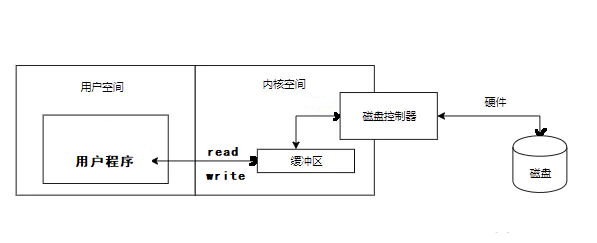

* 作用

  1. 减少和磁盘的交互次数，保护磁盘。
  2. 提高了对文件的读写效率。

* 缓冲区设置

  | 类型           | 设置方法     | 注意事项             |
  | -------------- | ------------ | -------------------- |
  | 系统自定义     | buffering=-1 |                      |
  | 行缓冲         | buffering=1  | 当遇到\n时刷新缓冲   |
  | 指定缓冲区大小 | buffering>1  | 必须以二进制方式打开 |

  

* 刷新缓冲区条件

1. 缓冲区被写满
2. 程序执行结束或者文件对象被关闭
3. 程序中调用flush()函数

```python
file_obj.flush()
```


#### 1.2.7 文件偏移量

* 定义

  打开一个文件进行操作时系统会自动生成一个记录，记录每次读写操作时所处的文件位置，每次文件的读写操作都是从这个位置开始进行的。

  

  > 注意：
  >
  > 1. r或者w方式打开，文件偏移量在文件开始位置
  > 2. a方式打开，文件偏移量在文件结尾位置

* 文件偏移量控制

  ```python
  tell()
  功能：获取文件偏移量大小
  返回值：文件偏移量
  ```

   ```python
  seek(offset[,whence])
  功能: 移动文件偏移量位置
  参数：offset  代表相对于某个位置移动的字节数。负数表示向前移动，正数表示向后移动。
       whence是基准位置的默认值为 0，代表从文件开头算起，1代表从当前位置算起，2 代表从文件  末尾算起。
   ```
	> 注意：必须以二进制方式打开文件时，基准位置才能是1或者2


### 1.3 os模块

os模块是Python标准库模块，包含了大量的文件处理函数。

* 获取文件大小  
```python
os.path.getsize(file)
功能： 获取文件大小
参数： 指定文件
返回值： 文件大小
```
* 查看文件列表    
```python
os.listdir(dir)
功能： 查看文件列表
参数： 指定目录
返回值：目录中的文件名列表
```

* 查看文件是否存在    
```python
os.path.exists(file)
功能： 查看文件是否存在 
参数： 指定文件
返回值：存在返回True，不存在返回False
```

*  判断文件类型   
```python
os.path.isfile(file)
功能： 判断文件类型 
参数： 指定文件
返回值：普通文件返回True，否则返回False
```

*   删除文件   
```python
os.remove(file)
功能： 删除文件 
参数： 指定文件
```

- 当前路径

os.path.


## 2. 正则表达式

### 2.1 概述

* 学习动机

1. 文本数据处理已经成为常见的编程工作之一
2. 对文本内容的搜索，定位，提取是逻辑比较复杂的工作
3. 为了快速方便的解决上述问题，产生了正则表达式技术

* 定义

即文本的高级匹配模式，其本质是由一系列字符和特殊符号构成的字串，这个字串即正则表达式。

* 原理

通过普通字符和有特定含义的字符，来组成字符串，用以描述一定的字符串规则，比如：重复，位置等，来表达某类特定的字符串，进而匹配。

* 学习目标

1. 熟练掌握正则表达式元字符
2. 能够读懂常用正则表达式，编辑简单的正则规则
3. 能够熟练使用re模块操作正则表达式


### 2.2 元字符使用

* 普通字符

匹配规则：每个普通字符匹配其对应的字符

```
e.g.
In : re.findall('ab',"abcdefabcd")
Out: ['ab', 'ab']
```

> 注意：正则表达式在python中也可以匹配中文


* 或关系

元字符: `|` 

匹配规则: 匹配 | 两侧任意的正则表达式即可

```
e.g.
In : re.findall('com|cn',"www.baidu.com/www.tmooc.cn")
Out: ['com', 'cn']

```


* 匹配单个字符

元字符：`.`

匹配规则：匹配除换行外的任意一个字符

```
e.g.
In : re.findall('张.丰',"张三丰,张四丰,张五丰")
Out: ['张三丰', '张四丰', '张五丰']

```


* 匹配字符集

元字符： `[字符集]`

匹配规则: 匹配字符集中的任意一个字符

表达形式: 

> [abc#!好] 表示 [] 中的任意一个字符
> [0-9],[a-z],[A-Z] 表示区间内的任意一个字符
> [_#?0-9a-z]  混合书写，一般区间表达写在后面

```
e.g.
In : re.findall('[aeiou]',"How are you!")
Out: ['o', 'a', 'e', 'o', 'u']
```


* 匹配字符集反集

元字符：`[^字符集]`

匹配规则：匹配除了字符集以外的任意一个字符

```
e.g.
In : re.findall('[^0-9]',"Use 007 port")
Out: ['U', 's', 'e', ' ', ' ', 'p', 'o', 'r', 't']
```


* 匹配字符串开始位置

元字符: `^`

匹配规则：匹配目标字符串的开头位置

```
e.g.
In : re.findall('^Jame',"Jame,hello")
Out: ['Jame']
```


* 匹配字符串的结束位置

元字符:  `$`

匹配规则: 匹配目标字符串的结尾位置

```
e.g.
In : re.findall('Jame$',"Hi,Jame")
Out: ['Jame']
```

> 规则技巧: `^` 和` $`必然出现在正则表达式的开头和结尾处。如果两者同时出现，则中间的部分必须匹配整个目标字符串的全部内容。


* 匹配字符重复

元字符: `*`

匹配规则：匹配前面的字符出现0次或多次

```
e.g.
In : re.findall('wo*',"wooooo~~w!")
Out: ['wooooo', 'w']
```

------

元字符：`+`

匹配规则： 匹配前面的字符出现1次或多次

```
e.g.
In : re.findall('[A-Z][a-z]+',"Hello World")
Out: ['Hello', 'World']
```

------

元字符：`?`

匹配规则： 匹配前面的字符出现0次或1次

```
e.g. 匹配整数
In [28]: re.findall('-?[0-9]+',"Jame,age:18, -26")
Out[28]: ['18', '-26']
```

------

元字符：`{n}`

匹配规则： 匹配前面的字符出现n次

```
e.g. 匹配手机号码
In : re.findall('1[0-9]{10}',"Jame:13886495728")
Out: ['13886495728']

```

------

元字符：`{m,n}`

匹配规则： 匹配前面的字符出现m-n次

```
e.g. 匹配qq号
In : re.findall('[1-9][0-9]{5,10}',"Baron:1259296994") 
Out: ['1259296994']
```


* 匹配任意（非）数字字符

元字符： `\d`   `\D`

匹配规则：`\d` 匹配任意数字字符，`\D` 匹配任意非数字字符

```
e.g. 匹配端口
In : re.findall('\d{1,5}',"Mysql: 3306, http:80")
Out: ['3306', '80']
```


* 匹配任意（非）普通字符

元字符： `\w`   `\W`

匹配规则: `\w` 匹配普通字符，`\W` 匹配非普通字符

说明: 普通字符指数字，字母，下划线，汉字。

```
e.g.
In : re.findall('\w+',"server_port = 8888")
Out: ['server_port', '8888']
```


* 匹配任意（非）空字符

元字符： `\s`   `\S`

匹配规则:` \s`匹配空字符，`\S` 匹配非空字符

说明：空字符指 空格` \r \n \t \v \f` 字符

```
e.g.
In : re.findall('\w+\s+\w+',"hello    world")
Out: ['hello    world']
```


* 匹配（非）单词的边界位置

元字符：` \b`   `\B`

匹配规则：` \b` 表示单词边界，`\B` 表示非单词边界

说明：单词边界指数字字母(汉字)下划线与其他字符的交界位置。

```
e.g.
In : re.findall(r'\bis\b',"This is a test.")
Out: ['is']
```

> 注意： 当元字符符号与Python字符串中转义字符冲突的情况则需要使用r将正则表达式字符串声明为原始字符串，如果不确定那些是Python字符串的转义字符，则可以在所有正则表达式前加r。


| 类别     | 元字符                           |
| -------- | -------------------------------- |
| 匹配字符 | `.`   `[...]`   `[^...]`   \d   \D   \w   \W   \s   \S |
| 匹配重复 | `*`   `+`   `?`   `{n}`   `{m,n}`               |
| 匹配位置 | `^`   $   \b   \B            |
| 其他    |  `|`    ` ()`      ` \ `                   |


### 2.3 匹配规则


#### 2.3.1 特殊字符匹配

* 目的 ： 如果匹配的目标字符串中包含正则表达式特殊字符，则在表达式中元字符就想表示其本身含义时就需要进行 \ 处理。

  ```
  特殊字符: . * + ? ^ $ [] () {} | \
  ```

  

* 操作方法：在正则表达式元字符前加 \ 则元字符就是去其特殊含义，就表示字符本身

```python
e.g. 匹配特殊字符 . 时使用 \. 表示本身含义
In : re.findall('-?\d+\.?\d*',"123,-123,1.23,-1.23")
Out: ['123', '-123', '1.23', '-1.23']
```


#### 2.3.2 贪婪模式和非贪婪模式

* 定义

> 贪婪模式: 默认情况下，匹配重复的元字符总是尽可能多的向后匹配内容。比如: *  +  ?  {m,n}

> 非贪婪模式(懒惰模式): 让匹配重复的元字符尽可能少的向后匹配内容。


* 贪婪模式转换为非贪婪模式

在对应的匹配重复的元字符后加 '?' 号即可

```python
*  ->  *?
+  ->  +?
?  ->  ??
{m,n} -> {m,n}?
```

```python
e.g.
In : re.findall(r'\(.+?\)',"(abcd)efgh(higk)")
Out: ['(abcd)', '(higk)']
```


#### 2.3.3 正则表达式分组

* 定义

在正则表达式中，以()建立正则表达式的内部分组，子组是正则表达式的一部分，可以作为内部整体操作对象。

* 作用 : 可以被作为整体操作，改变元字符的操作对象

```
e.g.  改变 +号 重复的对象
In : re.search(r'(ab)+',"ababababab").group()
Out: 'ababababab'

e.g. 改变 |号 操作对象
In : re.search(r'(王|李)\w{1,3}',"王者荣耀").group()
Out: '王者荣耀'
```

* 捕获组

捕获组本质也是一个子组，只不过拥有一个名称用以表达该子组的意义，这种有名称的子组即为捕获组。

> 格式：`(?P<name>pattern)`

```
e.g. 给子组命名为 "pig"
In : re.search(r'(?P<pig>ab)+',"ababababab").group('pig')
Out: 'ab'

```

* 注意事项

- 一个正则表达式中可以包含多个子组
- 子组可以嵌套但是不宜结构过于复杂
- 子组序列号一般从外到内，从左到右计数


#### 2.3.4 正则表达式匹配原则

1. 正确性,能够正确的匹配出目标字符串.
2. 排他性,除了目标字符串之外尽可能少的匹配其他内容.
3. 全面性,尽可能考虑到目标字符串的所有情况,不遗漏.


### 2.4 Python re模块使用


#### 2.4.1 基础函数使用

------


```python
 re.findall(pattern,string,flags = 0)
 功能: 根据正则表达式匹配目标字符串内容
 参数: pattern  正则表达式
      string 目标字符串
      flags  功能标志位,扩展正则表达式的匹配
 返回值: 匹配到的内容列表,如果正则表达式有子组则只能获取到子组对应的内容
```

------


```python
 re.split(pattern,string,max，flags = 0)
 功能: 使用正则表达式匹配内容,切割目标字符串
 参数: pattern  正则表达式
      string 目标字符串
      max 最多切割几部分
      flags  功能标志位,扩展正则表达式的匹配
 返回值: 切割后的内容列表
```

------

```python
 re.sub(pattern,replace,string,count,flags = 0)
 功能: 使用一个字符串替换正则表达式匹配到的内容
 参数: pattern  正则表达式
      replace  替换的字符串
      string 目标字符串
      count  最多替换几处,默认替换全部
      flags  功能标志位,扩展正则表达式的匹配
 返回值: 替换后的字符串
```

------


#### 2.4.2  生成match对象

```python
 re.finditer(pattern,string,flags = 0)
 功能: 根据正则表达式匹配目标字符串内容
 参数: pattern  正则表达式
      string 目标字符串
      flags  功能标志位,扩展正则表达式的匹配
 返回值: 匹配结果的迭代器
```

------

```python
re.match(pattern,string,flags=0)
功能：匹配某个目标字符串开始位置
参数：pattern 正则
	string  目标字符串
返回值：匹配内容match object
```

------

```python
re.search(pattern,string,flags=0)
功能：匹配目标字符串第一个符合内容
参数：pattern 正则
	string  目标字符串
返回值：匹配内容match object
```


#### 2.4.3 match对象使用


- span()  获取匹配内容的起止位置

- groupdict()  获取捕获组字典，组名为键，对应内容为值

- group(n = 0)

  功能：获取match对象匹配内容
  
  参数：默认为0表示获取整个match对象内容，如果是序列号或者组名则表示获取对应子组内容
  
  返回值：匹配字符串


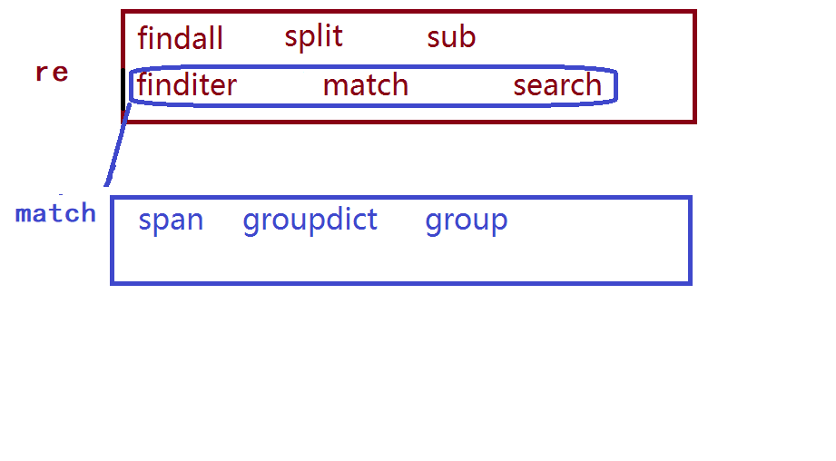


#### 2.4.4 flags参数扩展


* 作用函数：re模块调用的匹配函数。如：re.findall,re.search....

* 功能：扩展丰富正则表达式的匹配功能

* 常用flag

  ```re
  A == ASCII  元字符只能匹配ascii码
  
  I == IGNORECASE  匹配忽略字母大小写
  
  S == DOTALL  使 . 可以匹配换行
  
  M == MULTILINE  使 ^  $可以匹配每一行的开头结尾位置
  ```

>  注意：同时使用多个flag，可以用竖线连接   flags = re.I | re.A


## 3. 数据库


### 3.1概述

* 数据存储

1. 人工管理阶段

   缺点 ：  数据存储量有限，共享处理麻烦，操作容易混乱

2. 文件管理阶段 （.txt  .doc  .xls）
   
   优点 ：  数据可以长期保存,可以存储大量的数据,使用简单。

   缺点 ：  数据一致性差,数据查找修改不方便,数据冗余度可能比较大。

3. 数据库管理阶段

   优点 ： 数据组织结构化降低了冗余度,提高了增删改查的效率,容易扩展,方便程序调用处理

   缺点 ： 需要使用sql 或者其他特定的语句，相对比较专业


* 数据库应用领域

  数据库的应用领域几乎涉及到了需要数据管理的方方面面，融机构、游戏网站、购物网站、论坛网站 ... ...都需要数据库进行数据存储管理。 


* 基本概念
* 数据库 ： 按照数据一定结构，存储管理数据的仓库。数据库是在数据库管理系统管理和控制下，在一定介质上的数据集合。
  
* 数据库管理系统 ：管理数据库的软件，用于建立和维护数据库。
  
* 数据库系统 ： 由数据库和数据库管理系统，开发工具等组成的集合 。

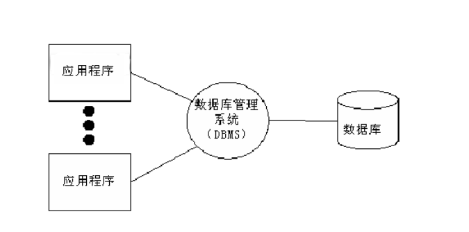


* 数据库分类和常见数据库
  
  * 关系型数据库和非关系型数据库
	>关系型： 采用关系模型（二维表）来组织数据结构的数据库 
	>
	>非关系型： 不采用关系模型组织数据结构的数据库

  * 开源和非开源	
	> 开源：MySQL、SQLite、MongoDB
  >
  > 非开源：Oracle、DB2、SQL_Server

  

### 3.2 MySQL

1996年，MySQL 1.0发布,作者Monty Widenius, 为一个叫TcX的公司打工，当时只是内部发布。到了96年10月，MySQL 3.11.1发布了，一个月后，Linux版本出现了。真正的MySQL关系型数据库于1998年1月发行第一个版本。MySQL是个开源数据库，后来瑞典有了专门的MySQL开发公司，将该数据库发展壮大，在之后被Sun收购，Sun又被Oracle收购。

官网地址：[https://www.mysql.com/](https://www.mysql.com/)


* MySQL特点
  1. 是开源数据库，使用C和C++编写 
  2. 能够工作在众多不同的平台上
  3. 提供了用于C、C++、Python、Java、Perl、PHP、Ruby众多语言的API
  4. 存储结构优良，运行速度快
  5. 功能全面丰富


* MySQL安装
  * Ubuntu安装MySQL服务
    * 终端执行: sudo apt  install mysql-server
    * 配置文件：/etc/mysql
    * 数据库存储目录 ：/var/lib/mysql
  * Windows安装MySQL
    * 下载MySQL安装包(windows)  [https://dev.mysql.com/downloads/windows/installer/8.0.html](https://dev.mysql.com/downloads/windows/installer/8.0.html)
    * 直接运行安装文件安装


* 启动和连接MySQL服务

  * 服务端启动
    * 查看MySQL状态 : sudo  service  mysql  status
    * 启动/停止/重启服务：sudo  service  mysql    start/stop/restart

  * 连接数据库
     ```sql
    mysql    -h  主机地址   -u  用户名    -p  
    ```

    > 注意： 
    >
    > 1. 回车后输入数据库密码 （我们设置的是123456）
    >
    > 2. 如果链接自己主机数据库可省略 -h 选项

  * 关闭连接

     ```sql
     ctrl-D
     exit
     ```


* MySQL数据库结构

>数据元素 --> 记录 -->数据表 --> 数据库


* 基本概念解析
  * 数据表（table） ： 存放数据的表格 
  * 字段（column）： 每个列，用来表示该列数据的含义
  * 记录（row）： 每个行，表示一组完整的数据


### 3.3 SQL语言

* 什么是SQL

结构化查询语言(Structured Query Language)，一种特殊目的的编程语言，是一种数据库查询和程序设计语言，用于存取数据以及查询、更新和管理关系数据库系统。

* SQL语言特点
  * SQL语言基本上独立于数据库本身
  * 各种不同的数据库对SQL语言的支持与标准存在着细微的不同
  * 每条命令以 ; 结尾
  * SQL命令（除了数据库名和表名）关键字和字符串可以不区分字母大小写


### 3.4 数据库管理

1. 查看已有库

>show databases;

2. 创建库

>create database 库名 [character set utf8];

```sql
e.g. 创建stu数据库，编码为utf8
create database stu character set utf8;
create database stu charset=utf8;
```
> 注意：库名的命名
>1.  数字、字母、下划线,但不能使用纯数字
>2. 库名区分字母大小写
>3. 不要使用特殊字符和mysql关键字

3. 切换库
>use 库名;

```sql
e.g. 使用stu数据库
use stu;
```

4. 查看当前所在库
>select database();

5. 删除库

>drop database 库名;

```sql
e.g. 删除test数据库
drop database test;
```


### 3.5 数据表管理

* 基本思考过程
  1. 确定存储内容
  2. 明确字段构成
  3. 确定字段数据类型

#### 3.5.1 基础数据类型

* 数字类型：
  * 整数类型：INT，SMALLINT，TINYINT，MEDIUMINT，BIGINT
  * 浮点类型：FLOAT，DOUBLE，DECIMAL
  * 比特值类型：BIT


> 注意：
>
> 1. 对于准确性要求比较高的东西，比如money，用decimal类型减少存储误差。声明语法是DECIMAL(M,D)。M是数字的最大数字位数，D是小数点右侧数字的位数。比如 DECIMAL(6,2)最多存6位数字，小数点后占2位,取值范围-9999.99到9999.99。
> 2. 比特值类型指0，1值表达2种情况，如真，假

----------------------------------

* 字符串类型：
  * 普通字符串： CHAR，VARCHAR
  * 存储文本： text
  * 存储二进制数据： BLOB
  * 存储选项型数据：ENUM，SET


> 注意：
>
> 1. char：定长，即指定存储字节数后，无论实际存储了多少字节数据，最终都占指定的字节大小。默认只能存1字节数据。存取效率高。
> 2. varchar：不定长，效率偏低 ，但是节省空间，实际占用空间根据实际存储数据大小而定。必须要指定存储大小 varchar(50)
> 3. enum用来存储给出的多个值中的一个值,即单选，enum('A','B','C')
> 4. set用来存储给出的多个值中一个或多个值，即多选，set('A','B','C')


#### 3.5.2 表的基本操作

* 创建表

>create table 表名(字段名 数据类型 约束,字段名 数据类型 约束,...字段名 数据类型 约束);

* 字段约束
  * 如果你想设置数字为无符号则加上 unsigned
  * 如果你不想字段为 NULL 可以设置字段的属性为 NOT NULL， 在操作数据库时如果输入该字段的数据为NULL ，就会报错。
  * DEFAULT 表示设置一个字段的默认值
  * COMMENT  增加字段说明
  * AUTO_INCREMENT定义列为自增的属性，一般用于主键，数值会自动加1。
  * PRIMARY KEY 关键字用于定义列为主键。主键的值不能重复,且不能为空。

```sql
e.g.  创建班级表
create table class_1 (id int primary key auto_increment,name varchar(32) not null,age tinyint unsigned not null,sex enum('w','m'),score float default 0.0);

e.g. 创建兴趣班表
create table interest (id int primary key auto_increment,name varchar(32) not null,hobby set('sing','dance','draw'),level char not null,price decimal(6,2),remark text);
```

* 查看数据表

	> show tables；

* 查看表结构

	> desc 表名;

* 查看数据表创建信息

	>  show create table 表名；

* 删除表

	> drop table 表名;


### 3.6 表数据基本操作

#### 3.5.1 插入(insert)

```SQL
insert into 表名 values(值1),(值2),...;
insert into 表名(字段1,...) values(值1),...;
```

```sql
e.g. 
insert into class_1 values (2,'Baron',10,'m',91),(3,'Jame',9,'m',90);

insert into class_1 (name,age,sex,score) values ('Lucy',17,'w',81);

```

#### 3.6.2 查询(select)

```SQL
select * from 表名 [where 条件];
select 字段1,字段2 from 表名 [where 条件];
```

```sql
e.g. 
select * from class_1;
select name,age from class_1;
```


#### 3.6.3 where子句

where子句在sql语句中扮演了重要角色，主要通过一定的运算条件进行数据的筛选，在查询，删除，修改中都有使用。

* 算数运算符


```sql
e.g.
select * from class_1 where age % 2 = 0;
```

* 比较运算符


```sql
e.g.
select * from class_1 where age > 8;
select * from class_1 where between 8 and 10;
select * from class_1 where age in (8,9);
```

* 逻辑运算符


```sql
e.g.
select * from class_1 where sex='m' and age>9;
```


```
查询练习

1. 查找30多元的图书
２．查找人民教育出版社出版的图书　
３．查找老舍写的，中国文学出版社出版的图书　
４．查找备注不为空的图书
５．查找价格超过６０元的图书，只看书名和价格
６．查找鲁迅写的或者茅盾写的图书
```


#### 3.6.4 更新表记录(update)

```SQL
update 表名 set 字段1=值1,字段2=值2,... where 条件;

注意:update语句后如果不加where条件,所有记录全部更新
```

```sql
e.g.
update class_1 set age=11 where name='Abby';
```


#### 3.6.5 删除表记录（delete）

```SQL
delete from 表名 where 条件;

注意:delete语句后如果不加where条件,所有记录全部清空
```
```sql
e.g.
delete from class_1 where name='Abby';
```


#### 3.6.6 表字段的操作(alter)

```SQL
语法 ：alter table 表名 执行动作;

* 添加字段(add)
    alter table 表名 add 字段名 数据类型;
    alter table 表名 add 字段名 数据类型 first;
    alter table 表名 add 字段名 数据类型 after 字段名;
* 删除字段(drop)
    alter table 表名 drop 字段名;
* 修改数据类型(modify)
    alter table 表名 modify 字段名 新数据类型;
* 修改字段名(change)
    alter table 表名 change 旧字段名 新字段名 新数据类型;
* 表重命名(rename)
    alter table 表名 rename 新表名;
```

```sql
e.g. 
alter table hobby add tel char(11) after name;
alter table hobby modify tel char(16);
alter table hobby change tel phone char(16);
```


#### 3.5.7 时间类型数据

* 日期 ： DATE
* 日期时间： DATETIME，TIMESTAMP
* 时间： TIME
* 年份 ：YEAR


* 时间格式

  ```sql
  date ："YYYY-MM-DD"
  time ："HH:MM:SS"
  datetime ："YYYY-MM-DD HH:MM:SS"
  timestamp ："YYYY-MM-DD HH:MM:SS"
  ```

  > 注意:
  >
  > 1. datetime ：以系统时间存储
  > 2. timestamp ：以标准时间存储但是查看时转换为系统时区，所以表现形式和datetime相同


```sql
e.g.
create table marathon (id int primary key auto_increment,athlete varchar(32),birthday date,registration_time datetime,performance time);
```


* 日期时间函数
  
  * now()  返回服务器当前日期时间,格式对应datetime类型
  
* 时间操作

  时间类型数据可以进行比较和排序等操作，在写时间字符串时尽量按照标准格式书写。

```sql
  select * from marathon where birthday>='2000-01-01';
  select * from marathon where birthday>="2000-07-01" and performance<="2:30:00";
```


```
练习 使用book表
1. 将呐喊的价格修改为45元
2. 增加一个字段出版时间 类型为 date 放在价格后面
3. 修改所有老舍的作品出版时间为 2018-10-1
4. 修改所有中国文学出版社出版的作为 出版时间为 2020-1-1
5. 修改所有出版时间为Null的图书 出版时间为 2019-10-1
6. 所有鲁迅的图书价格增加5元
7. 删除所有价格超过70元或者不到40元的图书

```


### 3.7 高级查询语句

* 模糊查询

  LIKE用于在where子句中进行模糊查询，SQL LIKE 子句中使用百分号` %`来表示任意0个或多个字符，下划线`_`表示任意一个字符。

  ```sql
	SELECT field1, field2,...fieldN 
	FROM table_name
	WHERE field1 LIKE condition1
	```
	
	```sql
	e.g. 
	mysql> select * from class_1 where name like 'A%';
	```
	
* as 用法

  在sql语句中as用于给字段或者表重命名

   ```sql
   select name as 姓名,age as 年龄 from class_1;
   select * from class_1 as c where c.age > 17;
   ```

* 排序

  ORDER BY 子句来设定你想按哪个字段哪种方式来进行排序，再返回搜索结果。

  使用 ORDER BY 子句将查询数据排序后再返回数据：

	```sql
	SELECT field1, field2,...fieldN from table_name1 where field1
	ORDER BY field1 [ASC [DESC]]
	```
	默认情况ASC表示升序，DESC表示降序

	```sql
	select * from class_1 where sex='m' order by age desc;
	```

	复合排序：对多个字段排序，即当第一排序项相同时按照第二排序项排序

	```sql
	select * from class_1 order by score desc,age;
	```

* 限制

  LIMIT 子句用于限制由 SELECT 语句返回的数据数量 或者 UPDATE,DELETE语句的操作数量

  带有 LIMIT 子句的 SELECT 语句的基本语法如下：

  ```sql
  SELECT column1, column2, columnN 
  FROM table_name
  WHERE field
  LIMIT [num] [OFFSET num]
  ```

  ```sql
  查询班级男生第三名
  select * from cls where sex='m' order by score desc limit 1 offset 2;
  ```

  

*  联合查询

	UNION 操作符用于连接两个以上的 SELECT 语句的结果组合到一个结果集合中。多个 SELECT 	语句会删除重复的数据。

	UNION 操作符语法格式：

	```sql
	SELECT expression1, expression2, ... expression_n
	FROM tables
	[WHERE conditions]
	UNION [ALL | DISTINCT]
	SELECT expression1, expression2, ... expression_n
	FROM tables
	[WHERE conditions];
	```

	默认UNION后卫 DISTINCT表示删除结果集中重复的数据。如果使用ALL则返回所有结果集，	包含重复数据。

    ```sql
    select * from class_1 where sex='m' UNION ALL select * from class_1 where age > 9;
    ```
* 子查询
	* 定义 ： 当一个select语句中包含另一个select 查询语句，则称之为有子查询的语句
	* 子查询出现的位置：
		1. from 之后 ，此时子查询的内容作为一个新的表内容，再进行外层select查询
		```sql
		select name from (select * from class_1 where sex='m') as s where s.score > 90;
		```
		>注意：  需要将子查询结果集重命名一下，方便where子句中的引用操作
	
		
		2. where字句中，此时select查询到的内容作为外层查询的条件值
	
		```sql
		 	select *  from class_1 where age = (select age from class_1 where name='Tom');
		```
		> 注意：
		>
		> 1. 子句结果作为一个值使用时，返回的结果需要一个明确值，不能是多行或者多列。
		> 2. 如果子句结果作为一个集合使用，即where子句中是in操作，则结果可以是一个字段的多个记录。
	
*  查询过程

通过之前的学习看到，一个完整的select语句内容是很丰富的。下面看一下select的执行过程：


    (5)SELECT DISTINCT <select_list>                     
    
    (1)FROM <left_table> <join_type> JOIN <right_table> ON <on_predicate>
    
    (2)WHERE <where_predicate>
    
    (3)GROUP BY <group_by_specification>
    
    (4)HAVING <having_predicate>
    
    (6)ORDER BY <order_by_list>
    
    (7)LIMIT <limit_number>


```sql
高级查询练习

在stu下创建数据报表 sanguo

字段：id  name  gender  country  attack  defense

create table sanguo(
id int primary key auto_increment,
name varchar(30),
gender enum('男','女'),
country enum('魏','蜀','吴'),
attack smallint,
defense tinyint
);


insert into sanguo
values (1, '曹操', '男', '魏', 256, 63),
       (2, '张辽', '男', '魏', 328, 69),
       (3, '甄姬', '女', '魏', 168, 34),
       (4, '夏侯渊', '男', '魏', 366, 83),
       (5, '刘备', '男', '蜀', 220, 59),
       (6, '诸葛亮', '男', '蜀', 170, 54),
       (7, '赵云', '男', '蜀', 377, 66),
       (8, '张飞', '男', '蜀', 370, 80),
       (9, '孙尚香', '女', '蜀', 249, 62),
       (10, '大乔', '女', '吴', 190, 44),
       (11, '小乔', '女', '吴', 188, 39),
       (12, '周瑜', '男', '吴', 303, 60),
       (13, '吕蒙', '男', '吴', 330, 71);

查找练习
1. 查找所有蜀国人信息，按照攻击力排名
2. 将赵云攻击力设置为360，防御设置为70
3. 吴国英雄攻击力超过300的改为300，最多改2个
4. 查找攻击力超过200的魏国英雄名字和攻击力并显示为姓名， 攻击力
5. 所有英雄按照攻击力降序排序，如果相同则按照防御生序排序
6. 查找名字为3字的
7. 查找攻击力为魏国最高攻击力的人还要高的蜀国英雄
8. 找到魏国排名2-3名的英雄
9. 查找所有女性角色中攻击力大于180的和男性中攻击力小于250的

```


### 3.8 聚合操作

聚合操作指的是在数据查找基础上对数据的进一步整理筛选行为，实际上聚合操作也属于数据的查询筛选范围。


#### 3.8.1 聚合函数

| 方法          | 功能                 |
| ------------- | -------------------- |
| avg(字段名)   | 该字段的平均值       |
| max(字段名)   | 该字段的最大值       |
| min(字段名)   | 该字段的最小值       |
| sum(字段名)   | 该字段所有记录的和   |
| count(字段名) | 统计该字段记录的个数 |
|               |                      |

eg1 : 找出表中的最大攻击力的值？

```mysql
select max(attack) from sanguo;
```

eg2 : 表中共有多少个英雄？

```mysql
select count(name) as number from sanguo;
```

eg3 : 蜀国英雄中攻击值大于200的英雄的数量

```mysql
select count(*) from sanguo where attack > 200; 
```

> 注意： 此时select 后只能写聚合函数，无法查找其他字段。


#### 3.8.2 聚合分组

- **group by**

给查询的结果进行分组

e.g.  : 计算每个国家的平均攻击力

```mysql
select country,avg(attack) from sanguo 
group by country;
```

e.g. :  对多个字段创建分组，此时多个字段都相同时为一组
```mysql
select age,sex,count(*) from class1 group by age,sex;
```


e.g. : 所有国家的男英雄中 英雄数量最多的前2名的 国家名称及英雄数量

```mysql
select country,count(id) as number from sanguo 
where gender='M' group by country
order by number DESC
limit 2;
```

>  注意： 使用分组时select 后的字段为group by分组的字段和聚合函数，不能包含其他内容。group by也可以同时依照多个字段分组，如group by A，B 此时必须A,B两个字段值均相同才算一组。


#### 3.8.3 聚合筛选

- **having语句**

对分组聚合后的结果进行进一步筛选

```mysql
eg1 : 找出平均攻击力大于105的国家的前2名,显示国家名称和平均攻击力

select country,avg(attack) from sanguo 
group by country
having avg(attack)>105
order by avg(attack) DESC
limit 2;
```

> 注意
>
> 1. having语句必须与group by联合使用。
> 2. having语句存在弥补了where关键字不能与聚合函数联合使用的不足,where只能操作表中实际存在的字段。


#### 3.8.4 去重语句

- **distinct语句**

不显示字段重复值

```mysql
eg1 : 表中都有哪些国家
  select distinct name,country from sanguo;
eg2 : 计算一共有多少个国家
  select count(distinct country) from sanguo;
```

> 注意: distinct和from之间所有字段都相同才会去重


#### 3.8.5 聚合运算

- **查询表记录时做数学运算**

运算符 ： +  -  *  /  %  

```mysql
eg1: 查询时显示攻击力翻倍
  select name,attack*2 from sanguo;
eg2: 更新蜀国所有英雄攻击力 * 2
  update sanguo set attack=attack*2 where country='蜀国';
```

```
聚合练习

1. 统计每位作家出版图书的平均价格
2. 统计每个出版社出版图书数量
3. 查看总共有多少个出版社
4. 筛选出那些出版过超过50元图书的出版社，并按照其出版图书的平均价格降序排序
5. 统计同一时间出版图书的最高价格和最低价格
```


### 3.9 索引操作

#### 3.9.1 概述

- **定义**

索引是对数据库表中一列或多列的值进行排序的一种结构，使用索引可快速访问数据库表中的特定信息。

- **优缺点**
  - 优点 ： 加快数据检索速度,提高查找效率

  - 缺点 ：占用数据库物理存储空间，当对表中数据更新时,索引需要动态维护,降低数据写入效率

> 注意 ： 
> 1. 通常我们只在经常进行查询操作的字段上创建索引
> 2. 对于数据量很少的表或者经常进行写操作而不是查询操作的表不适合创建索引


#### 3.9.2 索引分类

*  普通(MUL) 

> 普通索引 ：字段值无约束,KEY标志为 MUL

* 唯一索引(UNI)

> 唯一索引(unique) ：字段值不允许重复,但可为 NULL,KEY标志为 UNI

* 主键索引（PRI）

> 一个表中只能有一个主键字段, 主键字段不允许重复,且不能为NULL，KEY标志为PRI。通常设置记录编号字段id,能唯一锁定一条记录


#### 3.9.3 索引创建

* 创建表时直接创建索引
```mysql
create table 表名(
字段名 数据类型，
字段名 数据类型，
index 索引名(字段名),
index 索引名(字段名),
unique 索引名(字段名)
);
```

* 在已有表中创建索引：

```mysql
create [unique] index 索引名 on 表名(字段名);
```

```sql
e.g.
create unique index name_index on cls(name);
```


- 主键索引添加

 ```sql
 alter table 表名 add primary key(id);
 ```


- 查看索引

```mysql
1、desc 表名;  --> KEY标志为：MUL 、UNI。
2、show index from 表名;
```

- 删除索引

```mysql
drop index 索引名 on 表名;
alter table 表名 drop primary key;  # 删除主键
```


* 扩展： 借助性能查看选项去查看索引性能

```sql
set  profiling = 1； 打开功能 （项目上线一般不打开）

show profiles  查看语句执行信息
```


### 3.10 外键约束和表关联关系

#### 3.10.1 外键约束

* 约束 : 约束是一种限制，它通过对表的行或列的数据做出限制，来确保表的数据的完整性、唯一性
* foreign key 功能 : 建立表与表之间的某种约束的关系，由于这种关系的存在，能够让表与表之间的数据，更加的完整，关连性更强，为了具体说明创建如下部门表和人员表。
* 示例

```sql
# 创建部门表
CREATE TABLE dept (id int PRIMARY KEY auto_increment,dname VARCHAR(50) not null);
```

```sql
# 创建人员表
CREATE TABLE person (
  id int PRIMARY KEY AUTO_INCREMENT,
  name varchar(32) NOT NULL,
  age tinyint DEFAULT 0,
  sex enum('m','w','o') DEFAULT 'o',
  salary decimal(8,2) DEFAULT 250.00,
  hire_date date NOT NULL,
  dept_id int
) ;
```

上面两个表中每个人员都应该有指定的部门，但是实际上在没有约束的情况下人员是可以没有部门的或者也可以添加一个不存在的部门，这显然是不合理的。

* 主表和从表：若同一个数据库中，B表的外键与A表的主键相对应，则A表为主表，B表为从表。

- foreign key 外键的定义语法：

  ```sql
  [CONSTRAINT symbol] FOREIGN KEY（外键字段） 
  
  REFERENCES tbl_name (主表主键)
  
  [ON DELETE {RESTRICT | CASCADE | SET NULL | NO ACTION}]
  
  [ON UPDATE {RESTRICT | CASCADE | SET NULL | NO ACTION}]
  ```

  该语法可以在 CREATE TABLE 和 ALTER TABLE 时使用
  

	```sql
	# 创建表时直接简历外键
	CREATE TABLE person (
	  id int PRIMARY KEY AUTO_INCREMENT,
	  name varchar(32) NOT NULL,
	  age tinyint DEFAULT 0,
	  sex enum('m','w','o') DEFAULT 'o',
	  salary decimal(10,2) DEFAULT 250.00,
	  hire_date date NOT NULL,
	  dept_id int ,
	  constraint dept_fk foreign key(dept_id) references dept(id));
	```

	```sql
	# 建立表后增加外键
	alter table person add constraint dept_fk foreign key(dept_id) references dept(id);
	```

	> 注意：
	> 1. 并不是任何情况表关系都需要建立外键来约束，如果没有类似上面的约束关系时也可以不建立。
	> 2. 从表的外键字段数据类型与指定的主表主键应该相同。


* 通过外键名称解除外键约束

	```sql
	alter table person drop foreign key dept_fk;
	
	# 查看外键名称
	show create table person;
	```
	
	> 注意：删除外键后发现desc查看索引标志还在，其实外键也是一种索引，需要将外键名称的索引删除之后才可以。


* 级联动作
  * restrict(默认)  :  on delete restrict  on update restrict
    * 当主表删除记录时，如果从表中有相关联记录则不允许主表删除
    * 当主表更改主键字段值时，如果从表有相关记录则不允许更改
  * cascade ：数据级联更新  on delete cascade   on update cascade
    * 当主表删除记录或更改被参照字段的值时,从表会级联更新
  * set null  :   on delete set null    on update set null
    * 当主表删除记录时，从表外键字段值变为null
    * 当主表更改主键字段值时，从表外键字段值变为null

  

#### 3.10.2 表关联设计

当我们应对复杂的数据关系的时候，数据表的设计就显得尤为重要，认识数据之间的依赖关系是更加合理创建数据表关联性的前提。常见的数据关系如下：

- 一对一关系

> 一张表的一条记录一定只能与另外一张表的一条记录进行对应，反之亦然。
>
> 举例 :  学生信息和学籍档案，一个学生对应一个档案，一个档案也只属于一个学生


 ``` sql
create table student(id int primary key auto_increment,name varchar(50) not null);

create table record(id int primary key auto_increment,
comment text not null,
st_id int unique,
constraint st_fk foreign key(st_id) references student(id) 
on delete cascade 
on update cascade
);
 ```


- 一对多关系

> 一张表中有一条记录可以对应另外一张表中的多条记录；但是反过来，另外一张表的一条记录
> 只能对应第一张表的一条记录，这种关系就是一对多或多对一
>
> 举例： 一个人可以拥有多辆汽车，每辆车登记的车主只有一人。

```sql
create table person(
  id varchar(32) primary key,
  name varchar(30),
  sex char(1),
  age int
);

create table car(
  id varchar(32) primary key,
  name varchar(30),
  price decimal(10,2),
  pid varchar(32),
  constraint car_fk foreign key(pid) references person(id)
);
```

- 多对多关系

> 一对表中（A）的一条记录能够对应另外一张表（B）中的多条记录；同时B表中的一条记录
> 也能对应A表中的多条记录
>
> 举例：一个运动员可以报多个项目，每个项目也会有多个运动员参加,这时为了表达多对多关系需要单独创建关系表。

```mysql
CREATE TABLE athlete (
  id int primary key AUTO_INCREMENT,
  name varchar(30),
  age tinyint NOT NULL,
  country varchar(30) NOT NULL,
  description varchar(30)
);

CREATE TABLE item (
  id int primary key AUTO_INCREMENT,
  rname varchar(30) NOT NULL
);

CREATE TABLE athlete_item (
   id int primary key auto_increment,
   aid int NOT NULL,
   tid int NOT NULL,
   CONSTRAINT athlete_fk FOREIGN KEY (aid) REFERENCES athlete (id),
   CONSTRAINT item_fk FOREIGN KEY (tid) REFERENCES item (id)
);
```


#### 3.10.3 E-R模型

* **定义**		

```mysql
E-R模型(Entry-Relationship)即 实体-关系 数据模型,用于数据库设计
用简单的图(E-R图)反映了现实世界中存在的事物或数据以及他们之间的关系
```

* **实体、属性、关系**

​	实体

```mysql
1、描述客观事物的概念
2、表示方法 ：矩形框
3、示例 ：一个人、一本书、一杯咖啡、一个学生
```

​	属性

```mysql
1、实体具有的某种特性
2、表示方法 ：椭圆形
3、示例
   学生属性 ：学号、姓名、年龄、性别、专业 ... 
   感受属性 ：悲伤、喜悦、刺激、愤怒 ...
```

​	关系

```mysql
1、实体之间的联系
2、一对一关联(1:1)
3、一对多关联(1:n)
4、多对多关联(m:n) 
```

* **ER图的绘制**

矩形框代表实体,菱形框代表关系,椭圆形代表属性


#### 3.10.4 表连接

如果多个表存在一定关联关系，可以多表在一起进行查询操作，其实表的关联整理与外键约束之间并没有必然联系，但是基于外键约束设计的具有关联性的表往往会更多使用关联查询查找数据。

* 简单多表查询

多个表数据可以联合查询，语法格式如下：

```sql
select  字段1,字段2... from 表1,表2... [where 条件]
```

```sql
e.g.
select * from dept,person where dept.id = person.dept_id;
```

* 内连接

内连接查询只会查找到符合条件的记录，其实结果和表关联查询是一样的,官方更推荐使用内连接查询。


```sql
SELECT 字段列表
    FROM 表1  INNER JOIN  表2
ON 表1.字段 = 表2.字段;
```

```sql
select * from person inner join  dept  on  person.dept_id =dept.id;
```

* 笛卡尔积

笛卡尔积就是将A表的每一条记录与B表的每一条记录强行拼在一起。所以，如果A表有n条记录，B表有m条记录，笛卡尔积产生的结果就会产生n*m条记录。

```sql
select * from person inner join  dept;
```


- 左连接  : 左表全部显示，显示右表中与左表匹配的项


```sql
SELECT 字段列表
    FROM 表1  LEFT JOIN  表2
ON 表1.字段 = 表2.字段;
```

```sql
select * from person left join  dept  on  person.dept_id =dept.id;

# 查询每个部门员工人数
select dname,count(name) from dept left join person on dept.id=person.dept_id group by dname;
```

- 右连接 ：右表全部显示，显示左表中与右表匹配的项


```sql
SELECT 字段列表
    FROM 表1  RIGHT JOIN  表2
ON 表1.字段 = 表2.字段;
```

```sql
select * from person right join  dept  on  person.dept_id =dept.id;
```


> 注意：我们尽量使用数据量大的表作为基准表，即左表


```sql
综合查询练习

create table class(cid int primary key auto_increment,
                  caption char(4) not null);

create table teacher(tid int primary key auto_increment,
                    tname varchar(32) not null);

create table student(sid int primary key auto_increment,
                    sname varchar(32) not null,
                    gender enum('male','female','others') not null default 'male',
                    class_id int,
                    foreign key(class_id) references class(cid)
                    on update cascade
                    on delete cascade);

create table course(cid int primary key auto_increment,
                   cname varchar(16) not null,
                   teacher_id int,
                   foreign key(teacher_id) references teacher(tid)
                   on update cascade
                   on delete cascade);

create table score(sid int primary key auto_increment,
                  student_id int,
                  course_id int,
                  number int(3) not null,
                  foreign key(student_id) references student(sid)
                   on update cascade
                   on delete cascade,
                   foreign key(course_id) references course(cid)
                   on update cascade
                   on delete cascade);

insert into class(caption) values('三年二班'),('三年三班'),('三年一班');
insert into teacher(tname) values('波多老师'),('苍老师'),('小泽老师');
insert into student(sname,gender,class_id) values('钢蛋','female',1),('铁锤','female',1),('山炮','male',2),('彪哥','male',3);
insert into course(cname,teacher_id) values('生物',1),('体育',1),('物理',2);
insert into score(student_id,course_id,number) values(1,1,60),(1,2,59),(2,2,100),(3,2,78),(4,3,66);

1. 查询每位老师教授的课程数量
2. 查询学生的信息及学生所在班级信息
3. 查询各科成绩最高和最低的分数,形式 : 课程ID  最高分  最低分
4. 查询平均成绩大于85分的所有学生学号,姓名和平均成绩
5. 查询课程编号为2且课程成绩在80以上的学生学号和姓名
6. 查询各个课程及相应的选修人数
```


### 3.11 视图

* 视图概念

视图是存储的查询语句,当调用的时候,产生结果集,视图充当的是虚拟表的角色。其实视图可以理解为一个表或多个表中导出来的表，作用和真实表一样，包含一系列带有行和列的数据 视图中，用户可以使用SELECT语句查询数据，也可以使用INSERT，UPDATE，DELETE修改记录，视图可以使用户操作方便，并保障数据库系统安全，如果原表改名或者删除则视图也失效。

* 创建视图

```sql
语法结构：

CREATE [OR REPLACE] VIEW [view_name] AS [SELECT_STATEMENT];

释义：

CREATE VIEW： 创建视图
OR REPLACE : 可选，如果添加原来有同名视图的情况下会覆盖掉原有视图
view_name ： 视图名称
SELECT_STATEMENT ：SELECT语句

e.g.
create view  c1 as select name,age from class_1;
```

* 视图表的增删改查操作

  视图的增删改查操作与一般表的操作相同，使用insert update delete select即可，但是原数据表的约束条件仍然对视图产生作用。

* 查看现有视图

  ```sql
  show full tables in stu where table_type like 'VIEW';
  ```

  

* 删除视图

  drop view [IF EXISTS] 视图名；

  IF EXISTS 表示如果存在，这样即使没有指定视图也不会报错。

  ```sql
  drop view if exists c1;
  ```

* 修改视图

  参考创建视图，将create关键字改为alter

  ```sql
  alter view  c1 as select name,age,score from class_1;
  ```

* 视图作用
  * 作用

  1. 是对数据的一种重构，不影响原数据表的使用。

  2. 简化高频复杂操作的过程，就像一种对复杂操作的封装。

  3. 提高安全性，可以给不同用户提供不同的视图。

  4. 让数据更加清晰。

     

  * 缺点

  1. 视图的性能相对较差，从数据库视图查询数据可能会很慢。
  
     


### 3.12 函数和存储过程

存储过程和函数是事先经过编译并存储在数据库中的一段sql语句集合，调用存储过程和函数可以简化应用开发工作，提高数据处理的效率。

#### 3.12.1 函数创建

```sql
delimiter 自定义符号　　-- 如果函数体只有一条语句, begin和end可以省略, 同时delimiter也可以省略

　　create function 函数名(形参列表) returns 返回类型　　-- 注意是retruns

　　begin

　　　　函数体　　　　-- 函数语句集,set @a 定义变量

　　　　return val

　　end  自定义符号

delimiter ;

释义：
delimiter 自定义符号 是为了在函数内些语句方便，制定除了;之外的符号作为函数书写结束标志,一般用$$或者//
形参列表 ： 形参名 类型   类型为mysql支持类型
返回类型:  函数返回的数据类型,mysql支持类型即可
函数体： 若干sql语句组成，如果只有一条语句也可以不写delimiter和begin,end
return: 返回指定类型返回值
```

```sql
e.g. 无参数的函数调用
delimiter $$
create function st() returns int 
begin 
return (select score from class_1 order by score desc limit 1); 
end $$
delimiter ;

select st();
```

```sql
e.g. 含有参数的函数调用
delimiter $$
create function queryNameById(uid int) 
returns varchar(20)
begin
return  (select name from class_1 where id=uid);
end $$
delimiter ;

select queryNameById(1);
```


* 设置变量
  * 用户变量方法：   set  @[变量名] = 值；使用时用@[变量名]。
  *  局部变量 ： 在函数内部设置  declare [变量名] [变量类型] ；局部变量可以使用set赋值或者使用into关键字。


#### 3.12.2存储过程创建

创建存储过程语法与创建函数基本相同，但是没有返回值。

```sql
delimiter 自定义符号　

　　create procedure 存储过程名(形参列表)

　　begin

　　　　存储过程　　　　-- 存储过程语句集,set @a 定义变量

　　end  自定义符号

delimiter ;

释义：
delimiter 自定义符号 是为了在函数内些语句方便，制定除了;之外的符号作为函数书写结束标志
形参列表 ：[ IN | OUT | INOUT ] 形参名 类型
          in 输入，out  输出，inout 可以输入也可以输出
存储过程： 若干sql语句组成，如果只有一条语句也可以不写delimiter和begin,end

```

```sql
e.g. 存储过程创建和调用
delimiter $$
create procedure st() 
begin 
    select name,age from class_1; 
    select name,score from class_1 order by score desc; 
end $$
delimiter ;

call st();
```

* 存储过程三个参数的区别
  * IN 类型参数可以接收变量也可以接收常量，传入的参数在存储过程内部使用即可，但是在存储过程内部的修改无法传递到外部。
  * OUT 类型参数只能接收一个变量，接收的变量不能够在存储过程内部使用（内部为NULL），但是可以在存储过程内对这个变量进行修改。因为定义的变量是全局的，所以外部可以获取这个修改后的值。
  * INOUT类型参数同样只能接收一个变量，但是这个变量可以在存储过程内部使用。在存储过程内部的修改也会传递到外部。
  
    

```sql
e.g. : 分别将参数类型改为IN OUT INOUT 看一下结果区别
delimiter $$
create procedure p_out ( OUT num int )
begin
    select num;
    set num=100;
    select num;
end $$

delimiter ;

set @num=10;
call p_out(@num)
```


#### 3.12.3 存储过程和存储函数操作

1. 调用存储过程

语法：

```
call 存储过程名字（[存储过程的参数[,……]])
```

2. 调用存储函数

语法：

```
select 存储函数名字（[存储过程的参数[,……]])
```

3. 使用show status语句查看存储过程和函数的信息

语法：

```
show {procedure|function} status [like’存储过程或存储函数的名称’]
```

显示内容：数据库、名字、类型、创建者、创建和修改日期

4.  使用show create语句查看存储过程和函数的定义

语法：

```
show create  {procedure|function}  存储过程或存储函数的名称
```

5. 查看所有函数或者存储过程

   ```sql
   select name from mysql.proc where db='stu' and type='[procedure/function]';
   ```

   

6. 删除存储过程或存储函数

语法：

```
DROP {PROCEDURE | FUNCTION} [IF EXISTS] sp_name
```


#### 3.12.4 函数和存储过程区别

1. 函数有且只有一个返回值，而存储过程不能有返回值。
2. 函数只能有输入参数，而存储过程可以有in,out,inout多个类型参数。
3. 存储过程中的语句功能更丰富，实现更复杂的业务逻辑，可以理解为一个按照预定步骤调用的执行过程，而函数中不能展示查询结果集语句，只是完成查询的工作后返回一个结果，功能针对性比较强。
4. 存储过程一般是作为一个独立的部分来执行(call调用)。而函数可以作为查询语句的一个部分来调用。


### 3.13 事务控制

#### 3.13.1 事务概述

MySQL 事务主要用于处理操作量大，复杂度高的数据。比如说，在人员管理系统中，你删除一个人员，既需要删除人员的基本资料，也要删除和该人员相关的信息，如信箱，文章等等，如果操作就必须同时操作成功，如果有一个不成功则所有数据都不动。这时候数据库操作语句就构成一个事务。事务主要处理数据的增删改操作。

* 定义

 > 一件事从开始发生到结束的过程


* 作用

> 确保数据操作过程中的安全。


#### 3.13.2 事务操作


1. 开启事务
```mysql
   mysql>begin; # 方法1
```
2. 开始执行事务中的若干条SQL命令（增删改）
3. 终止事务，若begin之后使用commit提交事务或者使用rollback进行事务回滚。
```mysql
   mysql>commit; # 事务中SQL命令都执行成功,提交到数据库,结束!
   mysql>rollback; # 有SQL命令执行失败,回滚到初始状态,结束!
```

> 注意：事务操作只针对数据操作。rollback不能对数据库，数据表结构操作恢复。


#### 3.13.3 事务四大特性

1. 原子性（atomicity）


>一个事务必须视为一个不可分割的最小工作单元，对于一个事务来说，不可能只执行其中的一部分操作,整个事务中的所有操作要么全部提交成功，要么全部失败回滚


2. 一致性（consistency）

> 事务完成时，数据必须处于一致状态，数据的完整性约束没有被破坏。

3. 隔离性（isolation）

> 数据库允许多个并发事务同时对其数据进行读写和修改的能力，而多个事务相互独立。隔离性可以防止多个事务并发执行时由于交叉执行而导致数据的不一致。

4. 持久性（durability）

> 一旦事务提交，则其所做的修改就会永久保存到数据库中。此时即使系统崩溃，修改的数据也不会丢失。


####  3.13.4 事务隔离级别

事务四大特性中的隔离性是在使用事务时最为需要注意的特性，因为隔离级别不同带来的操作现象也有区别

* 隔离级别

   - 读未提交：read uncommitted
   
     > 事物A和事物B，事物A未提交的数据，事物B可以读取到
     > 这里读取到的数据叫做“脏数据”
     > 这种隔离级别最低，这种级别一般是在理论上存在，数据库隔离级别一般都高于该级别

   - 读已提交：read committed
   
     > 事物A和事物B，事物A提交的数据，事物B才能读取到
     > 这种隔离级别高于读未提交
     > 换句话说，对方事物提交之后的数据，我当前事物才能读取到
     > 这种级别可以避免“脏数据”
     > 这种隔离级别会导致“不可重复读取”
   
   - 可重复读：repeatable read
   
     > 事务A和事务B，事务A提交之后的数据，事务B读取不到
     > 事务B是可重复读取数据
     > 这种隔离级别高于读已提交
     > MySQL默认级别
     > 虽然可以达到可重复读取，但是会导致“幻像读”
   
   - 串行化：serializable
   	
     > 事务A和事务B，事务A在操作数据库时，事务B只能排队等待
     > 这种隔离级别很少使用，吞吐量太低，用户体验差
     > 这种级别可以避免“幻像读”，每一次读取的都是数据库中真实存在数据，事务A与事务B串行，而不并发


### 3.14 数据库优化


#### 3.14.1 数据库设计范式

设计关系数据库时，遵从不同的规范要求，设计出合理的关系型数据库，这些不同的规范要求被称为不同的范式。

> 目前关系数据库有六种范式：第一范式（1NF）、第二范式（2NF）、第三范式（3NF）、巴斯-科德范式（BCNF）、第四范式(4NF）和第五范式（5NF，又称完美范式）。

各种范式呈递次规范，越高的范式数据库冗余越小。但是范式越高也意味着表的划分更细，一个数据库中需要的表也就越多，此时多个表联接在一起的花费是巨大的，尤其是当需要连接的两张或者多张表数据非常庞大的时候，表连接操作几乎是一个噩梦，这严重地降低了系统运行性能。所以通常数据库设计遵循第一第二第三范式，以避免数据操作异常,又不至于表关系过于复杂。


范式简介：

- 第一范式： 数据库表的每一列都是不可分割的原子数据项，而不能是集合，数组，记录等组合的数据项。简单来说要求数据库中的表示二维表，每个数据元素不可再分。

  例如： 在国内的话通常理解都是姓名是一个不可再拆分的单位，这时候就符合第一范式；但是在国外的话还要分为FIRST NAME和LAST NAME，这时候姓名这个字段就是还可以拆分为更小的单位的字段，就不符合第一范式了。

- 第二范式： 第二范式（2NF）要求数据库表中的每个实例或记录必须可以被唯一地区分，所有属性依赖于主属性。即选取一个能区分每个实体的属性或属性组，作为实体的唯一标识，每个属性都能被主属性筛选。其实简单理解要设置一个区分各个记录的主键就好了。

- 第三范式： 在第二范式的基础上属性不传递依赖，即每个属性不依赖其他非主属性。要求一个表中不包含已在其它表中包含的非主关键字信息。其实简单来说就是合理使用外键，使不同的表中不要有重复的字段就好了。


#### 3.14.2  MySQL存储引擎

* **定义**： mysql数据库管理系统中用来处理表的处理器

* **基本操作**

```mysql
1、查看所有存储引擎
   mysql> show engines;
2、查看已有表的存储引擎
   mysql> show create table 表名;
3、创建表指定
   create table 表名(...)engine=MyISAM;
4、已有表指定
   alter table 表名 engine=InnoDB;
```

* **常用存储引擎特点** 
  
  **InnoDB**		

	```mysql
	1. 支持行级锁,仅对指定的记录进行加锁，这样其它进程还是可以对同一个表中的其它记录进		行操作。
	2. 支持外键、事务、事务回滚
	3. 表字段和索引同存储在一个文件中
  		 1. 表名.frm ：表结构
   		 2. 表名.ibd : 表记录及索引文件
	```

  **MyISAM**
  
  ```sql
  1. 支持表级锁,在锁定期间，其它进程无法对该表进行写操作。如果你是写锁，则其它进程则		读也不允许
  2.  表字段和索引分开存储
        	 1. 表名.frm ：表结构
           2. 表名.MYI : 索引文件(my index)
           3. 表名.MYD : 表记录(my data)
  ```
  
  

* **如何选择存储引擎**

	```mysql
	1. 执行查操作多的表用 MyISAM(使用InnoDB浪费资源)
	2. 执行写操作多的表用 InnoDB
	
	 	CREATE TABLE tb_stu(
	 	id int(11) NOT NULL AUTO_INCREMENT,
	 	name varchar(30) DEFAULT NULL,
	 	sex varchar(2) DEFAULT NULL,
	 	PRIMARY KEY (id)
	 	)ENGINE=MyISAM;
	```


#### 3.14.3 字段数据类型选择

- 优先程度   数字 >  时间日期 > 字符串
- 同一级别   占用空间小的 > 占用空间多的

```
字符串在查询比较排序时数据处理慢
占用空间少，数据库占磁盘页少，读写处理就更快
```

- 对数据存储精确不要求 float > decimal
- 如果很少被查询可以用 TIMESTAMP（时间戳实际是整形存储）


#### 3.14.4 键的设置

- Innodb如果不设置主键也会自己设置隐含的主键，所以最好自己设置
- 尽量设置占用空间小的字段为主键
- 外键的设置用于保持数据完整性，但是会降低数据导入和操作效率，特别是高并发情况下，而且会增加维护成本
- 虽然高并发下不建议使用外键约束，但是在表关联时建议在关联键上建立索引，以提高查找速度


#### 3.14.5 explain语句

使用 EXPLAIN 关键字可以模拟优化器执行SQL查询语句，从而知道MySQL是如何处理你的SQL语句的。这可以帮你分析你的查询语句或是表结构的性能瓶颈。通过explain命令可以得到:

-  表的读取顺序
-  数据读取操作的操作类型
-  哪些索引可以使用
-  哪些索引被实际使用
-  表之间的引用
-  每张表有多少行被优化器查询

```sql
explain select * from class_1 where id <5;
```


EXPLAIN主要字段解析：

* table：显示这一行的数据是关于哪张表的

* type：这是最重要的字段之一，显示查询使用了何种类型。从最好到最差的连接类型为system、const、eq_reg、ref、range、index和ALL，一般来说，得保证查询至少达到range级别，最好能达到ref。

```
type中包含的值：
- system、const： 可以将查询的变量转为常量. 如id=1; id为 主键或唯一键.
- eq_ref： 访问索引,返回某单一行的数据.(通常在联接时出现，查询使用的索引为主键或唯一键)
- ref： 访问索引,返回某个值的数据.(可以返回多行) 通常使用=时发生 
- range： 这个连接类型使用索引返回一个范围中的行，比如使用>或<查找东西，并且该字段上建有索引时发生的情况
- index： 以索引的顺序进行全表扫描，优点是不用排序,缺点是还要全表扫描 
- ALL： 全表扫描，应该尽量避免
```

* possible_keys：显示可能应用在这张表中的索引。如果为空，表示没有可能应用的索引。

* key：实际使用的索引。如果为NULL，则没有使用索引。

* key_len：使用的索引的长度。在不损失精确性的情况下，长度越短越好

* rows：MySQL认为必须检索的用来返回请求数据的行数


#### 3.14.6 SQL优化

- 尽量选择数据类型占空间少，在where ，group by，order by中出现的频率高的字段建立索引

- 尽量避免使用 select * ...;用具体字段代替 * ,不要返回用不到的任何字段 

- 少使用like %查询，否则会全表扫描

- 控制使用自定义函数

- 单条查询最后添加 LIMIT 1，停止全表扫描

- where子句中不使用 != ,否则放弃索引全表扫描

- 尽量避免 NULL 值判断,否则放弃索引全表扫描
  
   优化前：select number from t1 where number is null;
   
   优化后：select number from t1 where number=0;
   
   * 在number列上设置默认值0,确保number列无NULL值
   
- 尽量避免 or 连接条件,否则会放弃索引进行全表扫描，可以用union代替
  
   优化前：select id from t1 where id=10 or id=20;
   
   优化后： select id from t1 where id=10 union all  select id from t1 where id=20;
   
- 尽量避免使用 in 和 not in,否则会全表扫描
  
   优化前：select id from t1 where id in(1,2,3,4);
   
   优化后：select id from t1 where id between 1 and 4;


#### 3.14.7 表的拆分

垂直拆分 ： 表中列太多，分为多个表，每个表是其中的几个列。将常查询的放到一起，blob或者text类型字段放到另一个表

水平拆分 ： 减少每个表的数据量，通过关键字进行划分然后拆成多个表


### 3.15 数据库备份和用户管理


#### 3.15.1 表的复制

1. 表能根据实际需求复制数据
2. 复制表时不会把KEY属性复制过来

**语法**

```mysql
create table 表名 select 查询命令;
```


#### 3.15.2 数据备份

1. 备份命令格式
> mysqldump -u  用户名  -p  源库名  >  ~/stu.sql

2. 恢复命令格式

> mysql -u  root -p  目标库名 < stu.sql


#### 3.15.3 用户权限管理

**开启MySQL远程连接**

```mysql
更改配置文件，重启服务！
1.cd /etc/mysql/mysql.conf.d
2.sudo vi mysqld.cnf  找到43行左右,加 # 注释
   # bind-address = 127.0.0.1
   
3.保存退出
4.sudo service mysql restart
5.进入mysql修改用户表host值 
  use mysql;
  update user set host='%' where user='root';
6.刷新权限
  flush privileges;
```

**添加授权用户**

```mysql
1. 用root用户登录mysql
   mysql -u root -p
2. 添加用户 % 表示自动选择可用IP
   CREATE USER 'username'@'host' IDENTIFIED BY 'password';
3. 权限管理

   # 增加权限
   grant 权限列表 on 库.表 to "用户名"@"%" identified by "密码" with grant option;
   
   # 删除权限
   revoke insert,update,select on 库.表 from 'user'@'%';
   
4. 刷新权限
   flush privileges;
5. 删除用户
   drop user "用户名"@"%"
```

**权限列表**

```
all privileges 、select 、insert ，update，delete，alter等。
库.表 ： *.* 代表所有库的所有表
```

**示例**

```mysql
1. 创建用户
  mysql>create user  'work'@'%'  identified by '123';
2. 添加授权用户work,密码123,对所有库的所有表有所有权限
  mysql>grant all privileges on *.* to 'work'@'%' identified by '123' with grant option;
  mysql>flush privileges;
3. 添加用户duty，密码123,对books库中所有表有查看，插入权限
  mysql>grant select,insert on books.* to 'duty'@'%' identified by '123' with grant option;
  mysql>flush privileges;
4. 删除work用户的删除权限
  mysql>revoke delete on *.* from "work"@"%";
5. 删除用户duty
  drop user "duty"@"%";
```


### 3.16 pymysql模块

pymysql是一个第三方库，如果自己的计算机上没有可以在终端使用命令进行安装。

```
sudo pip3 install pymysql
```


* pymysql使用流程

1. 建立数据库连接(db = pymysql.connect(...))
2. 创建游标对象(cur = db.cursor())
3. 游标方法: cur.execute("insert ....")
4. 提交到数据库或者获取数据 : db.commit()/cur.fetchall()
5. 关闭游标对象 ：cur.close()
6. 断开数据库连接 ：db.close()


* 常用函数

```python
db = pymysql.connect(参数列表)
功能: 链接数据库

host ：主机地址,本地 localhost
port ：端口号,默认3306
user ：用户名
password ：密码
database ：库
charset ：编码方式,推荐使用 utf8
```


```
cur = db.cursor() 
功能： 创建游标
返回值：返回游标对象,用于执行具体SQL命令
```


```
cur.execute(sql,list_) 
功能： 执行SQL命令
参数： sql sql语句
      list_  列表，用于给sql语句传递参量
      
cur.executemany(sql命令,list_)
功能： 多次执行SQL命令，执行次数由列表中元组数量决定
参数： sql sql语句
      list_  列表中包含元组 每个元组用于给sql语句传递参量，一般用于写操作。
```


```python
cur.fetchone() 获取查询结果集的第一条数据，查找到返回一个元组否则返回None
cur.fetchmany(n) 获取前n条查找到的记录，返回结果为元组嵌套元组， ((记录1),(记录2))，查询不到内容返回空元组。
cur.fetchall() 获取所有查找到的记录，返回结果形式同上。
cur.close() 关闭游标对象
```


```python
db.commit() 提交到数据库执行
db.rollback() 回滚，用于当commit()出错是回复到原来的数据形态
db.close() 关闭连接
```


* 文件存储
  * 存储文件路径
    * 优点：节省数据库空间，提取方便
    * 缺点：文件或者数据库发生迁移会导致文件丢失
  * 存储文件本身
    * 优点：安全可靠，数据库在文件就在
    * 缺点：占用数据库空间大，文件存取效率低

* * * 

综合项目及工具
==========================

| Tedu Python 教学部 |
| --- |
| Author：吕泽|

-----------


## 1. 软件项目开发

### 1.1 软件项目开发流程

```
需求分析 ----> 概要设计  ---> 项目计划 ----> 详细设计---> 编码测试 -----> 项目测试 ----> 调试修改 ---> 项目发布----> 后期维护
```

* 需求分析 ： 确定用户的真实需求 

>  1. 确定用户的真实需求，项目的基本功能
>  2. 确定项目的整体难度和可行性分析
>  3. 需求分析文档，用户确认

* 概要设计：对项目进行初步分析和整体设计

> 1. 确定整体架构
> 2. 进行技术可行性分析
> 3. 确定技术整体思路和使用框架模型
> 4. 形成概要文档指导开发流程


* 项目计划 ： 确定项目开发的时间轴和流程

> 1. 确定开发工作的先后顺序
> 2. 确定时间轴  ，事件里程碑
> 3. 人员分工 
> 4. 形成甘特图和思维导图等辅助内容


* 详细设计 ： 项目的具体实现

> 1.形成详细设计文档 ： 思路，逻辑流程，功能说明，技术点说明，数据结构说明，代码说明

* 编码测试 ： 按照预定计划实现代码编写，并且做基本检测

> 1. 代码编写
> 2. 写测试程序
> 3. 技术攻关

* 项目测试 ： 对项目按照功能进行测试

> 1. 跨平台测试 ，使用测试
> 2. 根据测试报告进行代码修改
> 3. 完成测试报告

* 项目发布

> 1.项目交付用户进行发布
>
> 2.编写项目说明文档

* 后期维护

> 1.维护项目正常运转
>
> 2.进行项目的迭代升级

### 1.2  开发注意事项

* 按时完成项目工作和项目时间不足之间的冲突
* 项目实施人员之间的冲突

### 1.3 项目管理工具

* 编写文档： word  ppt  excel  markdown   LaTex
* 项目流程图 ： Mindmanager  visio
* 项目管理 ： project
* 代码管理 ： svn   git


## 2. GIT和GitHub

### 2.1 GIT概述

* 什么是GIT

  GIT是一个开源的分布式版本控制系统，用于高效的管理各种大小项目和文件。

* 代码管理工具的用途
  * 防止代码丢失，做备份
  * 项目的版本管理和控制，可以通过设置节点进行跳转
  * 建立各自的开发环境分支，互不影响，方便合并
  * 在多终端开发时，方便代码的相互传输

* GIT的特点

  * git是开源的，多在*nix下使用，可以管理各种文件

  * git是分布式的项目管理工具(SVN是集中式的)

  * git数据管理更多样化，分享速度快，数据安全

  * git 拥有更好的分支支持，方便多人协调

    

* Linux下GIT安装

> sudo apt  install  git


### 2.2 GIT使用


* 基本概念
  * 工作区：项目所在操作目录，实际操作项目的区域
  * 暂存区: 用于记录工作区的工作（修改）内容
  * 仓库区: 用于备份工作区的内容
  * 远程仓库: 远程主机上的GIT仓库

> 注意： 在本地仓库中，git总是希望工作区的内容与仓库区保持一致，而且只有仓库区的内容才能和其他远程仓库交互。


#### 2.2.1 初始配置

* 配置命令： git config --global [选项]
* 配置文件位置:  ~/.gitconfig

1. 配置用户名

```
e.g. 将用户名设置为Tedu
sudo git config --global user.name Tedu
```

2. 配置用户邮箱

```
e.g. 将邮箱设置为lvze@tedu.cn
git config --global user.email lvze@tedu.cn
```

3. 查看配置信息

```
git config --list
```

> 注意： 该命令需要在某个git仓库下执行


#### 2.2.2 基本命令

* 初始化仓库

  ```
  git  init 
  意义：将某个项目目录变为git操作目录，生成git本地仓库。即该项目目录可以使用git管理
  ```

  

* 查看本地仓库状态

  ```git
  git  status
  说明: 初始化仓库后默认工作在master分支，当工作区与仓库区不一致时会有提示。
  ```

  

* 将工作内容记录到暂存区

  ```
  git add [files..]
  
  e.g. 将文件 a ，b 记录到暂存区
  git add  a b
  
  e.g. 将所有文件（不包含隐藏文件）记录到暂存区
  git add  *
  ```


* 取消文件暂存记录

  ```
  git rm --cached [file] 
  ```

* 设置忽略文件

  在GIT项目中可以在项目根目录添加**.gitignore**文件的方式，规定相应的忽略规则，用来管理当前项目中的文件的忽略行为。.gitignore 文件是可以提交到公有仓库中，这就为该项目下的所有开发者都共享一套定义好的忽略规则。在.gitignore 文件中，遵循相应的语法，在每一行指定一个忽略规则。

  

  ```
  .gitignore忽略规则简单说明
  
  file            表示忽略file文件
  *.a             表示忽略所有 .a 结尾的文件
  !lib.a          表示但lib.a除外
  build/          表示忽略 build/目录下的所有文件，过滤整个build文件夹；
  ```

  

* 将文件同步到本地仓库

```
git commit [file] -m [message]
说明: -m表示添加一些同步信息，表达同步内容,不加file表示同步所有暂存记录的文件

e.g.  将暂存区所有记录同步到仓库区
git commit  -m 'add files'
```


* 查看commit 日志记录

  ```
  git log
  git log --pretty=oneline
  ```

  

* 将暂存区或者某个commit点文件恢复到工作区

  ```
  git checkout [commit] -- [file]
  
  e.g. 将a.jpg文件恢复,不写commit表示恢复最新保存的文件内容
  git checkout  --  a.jpg
  ```

  

* 移动或者删除文件

  ```
  git  mv  [file] [path]
  git  rm  [files]
  注意: 这两个操作会修改工作区内容，同时将操作记录提交到暂存区。
  ```

  

### 2.3 版本控制

* 退回到上一个commit节点

  ```
  git reset --hard HEAD^
  说明： 一个^表示回退1个版本，依次类推。当版本回退之后工作区会自动和当前commit版本保持一致
  ```

  

* 退回到指定的commit_id节点

  ```
  git reset --hard [commit_id]
  ```

  

* 查看所有操作记录

  ```
  git reflog
  注意:最上面的为最新记录，可以利用commit_id去往任何操作位置
  ```

  

* 创建标签

  * 标签: 在项目的重要commit位置添加快照，保存当时的工作状态，一般用于版本的迭代。

    ```
    git  tag  [tag_name] [commit_id] -m  [message]
    说明: commit_id可以不写则默认标签表示最新的commit_id位置，message也可以不写，但是最好添加。
    
    e.g. 在最新的commit处添加标签v1.0
    git tag v1.0 -m '版本1'
    ```

    

* 查看标签

```
 git tag  查看标签列表
 git show [tag_name]  查看标签详细信息
```

* 去往某个标签节点
```
git reset --hard [tag]
```

* 删除标签
```
git tag -d  [tag]
```


###  2.4 保存工作区

* 保存工作区内容

  ```
  git stash save [message]
  说明: 将工作区未提交的修改封存，让工作区回到修改前的状态
  ```

* 查看工作区列表

  ```
  git stash  list
  说明:最新保存的工作区在最上面
  ```

* 应用某个工作区

  ```
  git stash  apply  [stash@{n}]
  ```

* 删除工作区

  ```
  git stash drop [stash@{n}]  删除某一个工作区
  git stash clear  删除所有保存的工作区
  ```


### 2.5 分支管理

#### 2.5.1 基本概念

* 定义: 分支即每个人在原有代码（分支）的基础上建立自己的工作环境，完成单独开发，之后再向主分支统一合并工作内容。

* 好处

  * 各自开发互不干扰

  * 防止误操作对其他开发者的影响

    

#### 2.5.2 基本操作

* 查看现有分支

  ```
  git branch
  说明: 前面带 * 的分支表示当前工作分支
  ```

  

* 创建分支

  ```
  git branch [branch_name]
  说明: 基于a分支创建b分支，此时b分支会拥有a分支全部内容。在创建b分支时最好保持a分支"干净"状态。
  ```

* 切换工作分支

  ```
  git checkout [branch]
  说明: 2,3可以同时操作，即创建并切换分支
  ```

  >  注意： git checkout -b [branch_name]  可以同时完成创建分支和切换分支的工作

* 合并分支

  ```
  git merge [branch]
  ```

  > 注意：分支的合并一般都是子分支向父分支中合并

* 删除分支

  ```
   git branch -d [branch]  删除分支
   git branch -D [branch]  删除没有被合并的分支
  ```

  

#### 2.5.3 分支冲突问题

* 定义： 当分支合并时，原来的父分支发生了变化，在合并过程中就会产生冲突问题，这是合并分支过程中最为棘手的问题。

* 冲突情形1—— 原来的分支增加了新文件或者原有文件发生了变化

  此时合并可能会出现:

  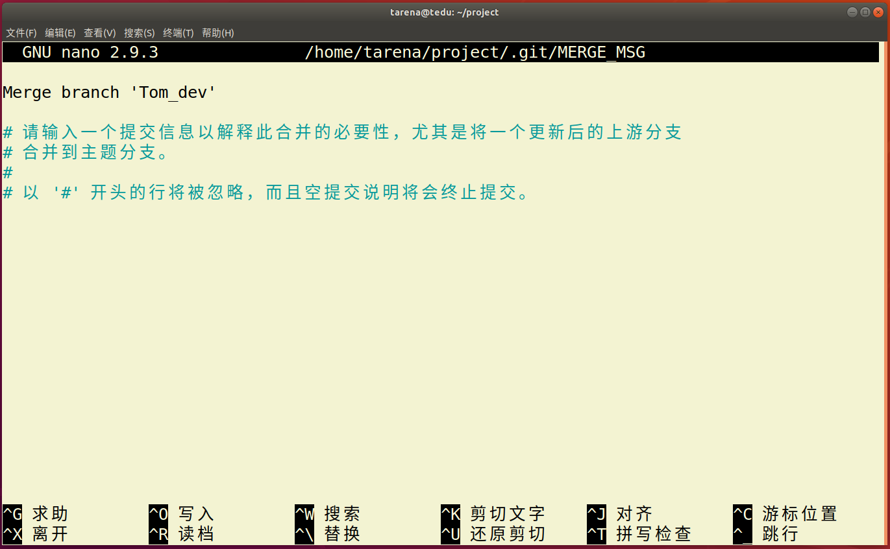

  此时只要先摁 **ctrl-o** 写入，然后回车，再摁**ctrl-x** 离开就可以了。

  也可能出现提示让直行commit合并，那么此时只需要直行commit操作就可以了。这种冲突比较好解决。

  

* 冲突情形2—— 子分支和父分支修改了相同的文件

  此时会出现：

  

  这种冲突不太好解决需要自己进入文件进行修改后，再直行add ，commit操作提交

* 总结

  * 尽量在项目中降低耦合度，不同的分支只编写自己的模块。
  * 如果必须修改原来父级分支的文件内容，那么做好分工，不要让多个分支都修改同一个文件。

### 2.6 GitHub使用

* 远程仓库

  远程主机上的GIT仓库。实际上git是分布式结构，每台主机的git仓库结构类似，只是把别人主机上的git仓库称为远程仓库。GitHub可以帮助我们建立一个远程仓库。

* GitHub介绍

  GitHub是一个开源的项目社区网站，拥有全球最多的开源项目。开发者通过可以注册网站账户，在GitHub建立自己的项目仓库（我们可以视作一个远程仓库）,GitHub规定GIT为它的唯一代码管理工具。

  GitHub网址：[github.com](https://github.com/)


#### 2.6.1 获取项目

- 在左上角搜索栏搜索想要的获取的项目


- 选择项目后复制项目git地址


- 在本地使用git clone方法即可获取

```
git clone https://github.com/xxxxxxxxx
```

> 注意:
>
> 1. 获取到本地的项目会自动和GitHub远程仓库建立连接。且获取的项目本身也是个git项目。
> 2. GitHub提供两种地址链接方式，http方式和SSH方式。通常访问自己的项目可以使用SSH方式，clone别人的项目使用http方式。  


#### 2.6.2 创建自己的项目仓库

- 点击右上角加号下拉菜单，选择新的仓库

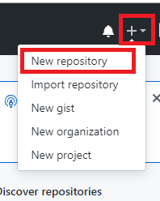

- 填写相应的项目信息即可

  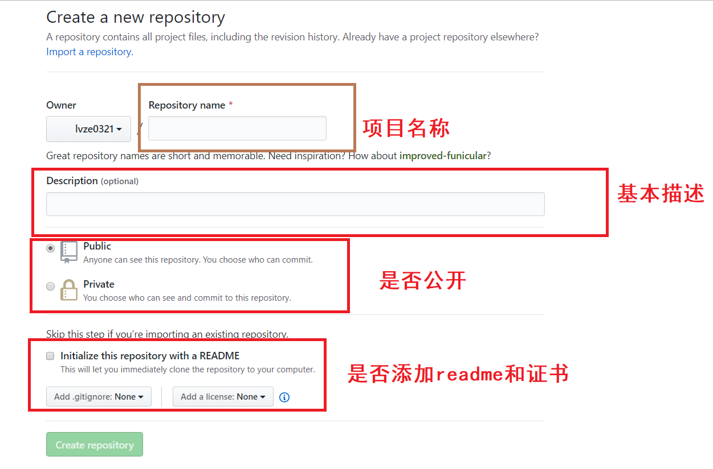

- github仓库相对本地主机就是一个远程仓库通过remote连接

  

  - 使用https链接

  	```
    # 后续操作每次上传内容都需要输入密码，比较麻烦，一般用于临时计算机的连接使用
    git remote  add origin https://github.com/xxxxxxxxx
    ```

  - 使用SSH连接

    ```
    # 先建立秘钥信任
    1. 将自己要连接github的计算机的ssh公钥内容复制
    2. github上选择头像下拉菜单，settings-》SSH and GPG keys-》new SSH key
    ```
  3. 将公钥内容添加进去，并且起一个标题名字，点击添加
  
    
  
    
  
    ```
   #后续无需输入密码，一般用于自己信任的计算机
    git remote add origin git@github.com:lvze0321/AID.git 
    ```

- 查看连接的远程仓库名称

  ```
  git remote
  ```

  

- 断开远程仓库连接

  ```
  git remote rm [origin]
  ```

  

- 如果是自己的仓库需要删除，则选择自己的仓库选择settings，在最后可以选择删除仓库。


#### 2.6.3 远程仓库操作命令

* 将本地分支推送给远程仓库

	```
	# 将master分支推送给origin主机远程仓库，第一次推送分支使用-u表示与远程对应分支	建立自动关联
	git push -u origin  master

	git push origin  [:branch]  # 删除向远程仓库推送的分支
	```

* 推送代码到远程仓库

	```
	# 如果本地的代码有修改项推送给远程仓库
	git push
	```

* 推送标签

   ```
   git push origin [tag]  推送一个本地标签到远程
    
   git push origin --tags  推送所有本地所有标签到远程
   
   git push origin --delete tag  [tagname]  删除向远程仓库推送的标签
   ```

  

* 推送旧的版本

  ```
  # 用于本地版本比远程版本旧时强行推送本地版本
  git push --force origin  
  ```


* 从远程获取代码

	```
	git pull
	```


## 3. 综合项目案例


### 3.1 在线词典

* 功能说明

>用户可以登录和注册

```
* 登录凭借用户名和密码登录
* 注册要求用户必须填写用户名，密码，其他内容自定
* 用户名要求不能重复
* 要求用户信息能够长期保存
```


>可以通过基本的图形界面print以提示客户端输入。

```
* 程序分为服务端和客户端两部分
* 客户端通过print打印简单界面输入命令发起请求
* 服务端主要负责逻辑数据处理
* 启动服务端后应该能满足多个客户端同时操作
```


>客户端启动后即进入一级界面，包含如下功能：登录    注册    退出

	* 退出后即退出该软件
	* 登录成功即进入二级界面，失败回到一级界面
	* 注册成功可以回到一级界面继续登录，也可以直接用注册用户进入二级界面


>用户登录后进入二级界面，功能如下：查单词    历史记录    注销

	* 选择注销则回到一级界面
	* 查单词：循环输入单词，得到单词解释，输入特殊符号退出单词查询状态
	* 历史记录：查询当前用户的查词记录，要求记录包含name   word   time。前10条即可。

并发网络编程
==========================

| Tedu Python 教学部 |
| --- |
| Author：吕泽|

-----------


## 1. 网络编程

### 1.1 网络基础知识


#### 1.1.1 什么是网络

* 什么是网络 : 计算机网络功能主要包括实现资源共享，实现数据信息的快速传递。

  

  

#### 1.1.2 网络通信标准

* 面临问题

  1. 不同的国家和公司都建立自己的通信标准不利于网络互连
  2. 多种标准并行情况下不利于技术的发展融合

  


* OSI 7层模型

  

  * 好处

    1. 建立了统一的通信标准

    2. 降低开发难度，每层功能明确，各司其职

    3. 七层模型实际规定了每一层的任务，该完成什么事情

    

* TCP/IP模型

  * 七层模型过于理想，结构细节太复杂
  * 在工程中应用实践难度大
  * 实际工作中以TCP/IP模型为工作标准流程

  
         

* 网络协议

  * 什么是网络协议：在网络数据传输中，都遵循的执行规则。

  * 网络协议实际上规定了每一层在完成自己的任务时应该遵循什么规范。


* 需要应用工程师做的工作 ： 编写应用工功能，明确对方地址，选择传输服务。

    

#### 1.1.3  通信地址


* IP地址

  * IP地址 ： 即在网络中标识一台计算机的地址编号。

  * IP地址分类

    * IPv4 ： 192.168.1.5 
    * IPv6 ：fe80::80a:76cf:ab11:2d73

  * IPv4 特点

    * 分为4个部分，每部分是一个整数，取值分为0-255

  * IPv6 特点（了解）

    * 分为8个部分，每部分4个16进制数，如果出现连续的数字 0 则可以用 ：：省略中间的0

  * IP地址相关命令

    * ifconfig : 查看Linux系统下计算机的IP地址

      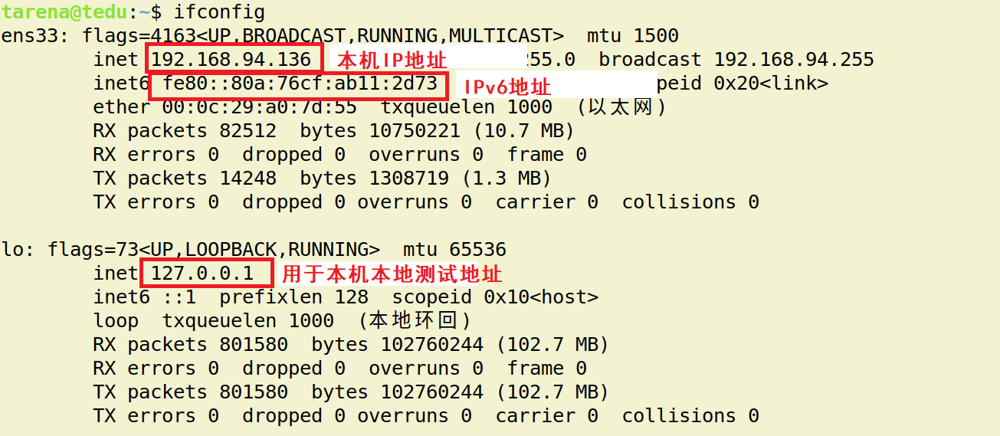

    * ping  [ip]：查看计算机的连通性 

      

  * 公网IP和内网IP

    * 公网IP指的是连接到互联网上的公共IP地址，大家都可以访问。（将来进公司，公司会申请公网IP作为网络项目的被访问地址）
    * 内网IP指的是一个局域网络范围内由网络设备分配的IP地址。

  

* 端口号

  * 端口：网络地址的一部分，在一台计算机上，每个网络程序对应一个端口。

    

  * 端口号特点

    * 取值范围： 0 —— 65535 的整数
    * 一台计算机上的网络应用所使用的端口不会重复
    * 通常 0——1023 的端口会被一些有名的程序或者系统服务占用，个人一般使用 > 1024的端口

#### 1.1.4 服务端与客户端

* 服务端（Server）：服务端是为客户端服务的，服务的内容诸如向客户端提供资源，保存客户端数据，处理客户端请求等。

* 客户端（Client） ：也称为用户端，是指与服务端相对应，为客户提供一定应用功能的程序，我们平时使用的手机或者电脑上的程序基本都是客户端程序。

  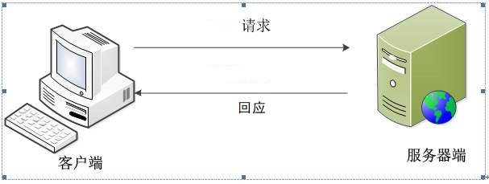


### 1.2 UDP 传输方法

#### 1.2.1 套接字简介

* 套接字(Socket) ： 实现网络编程进行数据传输的一种技术手段,网络上各种各样的网络服务大多都是基于 Socket 来完成通信的。

  

* Python套接字编程模块：import  socket


#### 1.2.3  UDP套接字编程

* 创建套接字

```python
sockfd=socket.socket(socket_family,socket_type,proto=0)
功能：创建套接字
参数：socket_family  网络地址类型 AF_INET表示ipv4
	 socket_type  套接字类型 SOCK_DGRAM 表示udp套接字 （也叫数据报套接字） 
	 proto  通常为0  选择子协议
返回值： 套接字对象
```


* 绑定地址
  * 本地地址 ： 'localhost' , '127.0.0.1'
  * 网络地址 ： '172.40.91.185' （通过ifconfig查看）
  * 自动获取地址： '0.0.0.0'


```python
sockfd.bind(addr)
功能： 绑定本机网络地址
参数： 二元元组 (ip,port)  ('0.0.0.0',8888)
```

* 消息收发

```python		    
data,addr = sockfd.recvfrom(buffersize)
功能： 接收UDP消息
参数： 每次最多接收多少字节
返回值： data  接收到的内容
	    addr  消息发送方地址

n = sockfd.sendto(data,addr)
功能： 发送UDP消息
参数： data  发送的内容 bytes格式
	  addr  目标地址
返回值：发送的字节数
```

* 关闭套接字

```python
sockfd.close()
功能：关闭套接字
```


* 服务端客户端流程

  


#### 1.2.4  UDP套接字特点

* 可能会出现数据丢失的情况
* 传输过程简单，实现容易
* 数据以数据包形式表达传输
* 数据传输效率较高


### 1.3 TCP 传输方法


#### 1.3.1 TCP传输特点


* 面向连接的传输服务
  * 传输特征 ： 提供了可靠的数据传输，可靠性指数据传输过程中无丢失，无失序，无差错，无重复。
  * 可靠性保障机制（都是操作系统网络服务自动帮应用完成的）： 
    * 在通信前需要建立数据连接
    * 确认应答机制
    * 通信结束要正常断开连接

* 三次握手（建立连接）
  * 客户端向服务器发送消息报文请求连接
  * 服务器收到请求后，回复报文确定可以连接
  * 客户端收到回复，发送最终报文连接建立

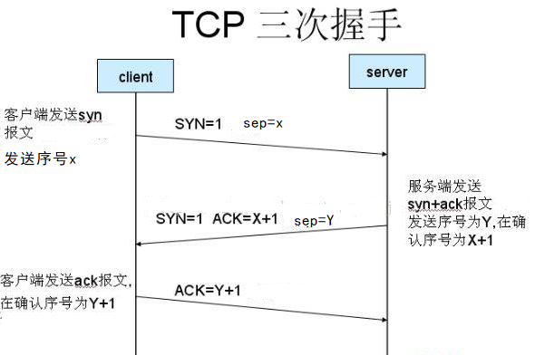
					

* 四次挥手（断开连接）
  * 主动方发送报文请求断开连接
  * 被动方收到请求后，立即回复，表示准备断开
  * 被动方准备就绪，再次发送报文表示可以断开
  * 主动方收到确定，发送最终报文完成断开


#### 1.3.2 TCP服务端


- 创建套接字

```python
sockfd=socket.socket(socket_family,socket_type,proto=0)
功能：创建套接字
参数：socket_family  网络地址类型 AF_INET表示ipv4
	 socket_type  套接字类型 SOCK_STREAM 表示tcp套接字 （也叫流式套接字） 
	 proto  通常为0  选择子协议
返回值： 套接字对象
```

- 绑定地址 （与udp套接字相同）


* 设置监听

```python
sockfd.listen(n)
功能 ： 将套接字设置为监听套接字，确定监听队列大小
参数 ： 监听队列大小
```

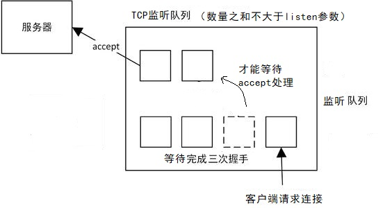

* 处理客户端连接请求

```python
connfd,addr = sockfd.accept()
功能： 阻塞等待处理客户端请求
返回值： connfd  客户端连接套接字
        addr  连接的客户端地址
```

* 消息收发

```python
data = connfd.recv(buffersize)
功能 : 接受客户端消息
参数 ：每次最多接收消息的大小
返回值： 接收到的内容

n = connfd.send(data)
功能 : 发送消息
参数 ：要发送的内容  bytes格式
返回值： 发送的字节数
```

6. 关闭套接字 (与udp套接字相同)


#### 1.3.3 TCP客户端 


* 创建TCP套接字
* 请求连接

```python
sockfd.connect(server_addr)
功能：连接服务器
参数：元组  服务器地址
```

* 收发消息

> 注意： 防止两端都阻塞，recv send要配合

* 关闭套接字


#### 1.3.4 TCP套接字细节

* tcp连接中当一端退出，另一端如果阻塞在recv，此时recv会立即返回一个空字串。

* tcp连接中如果一端已经不存在，仍然试图通过send向其发送数据则会产生BrokenPipeError

* 一个服务端可以同时连接多个客户端，也能够重复被连接

* tcp粘包问题

  * 产生原因

    * 为了解决数据再传输过程中可能产生的速度不协调问题，操作系统设置了缓冲区
    * 实际网络工作过程比较复杂，导致消息收发速度不一致
    * tcp以字节流方式进行数据传输，在接收时不区分消息边界

    

  * 带来的影响

    * 如果每次发送内容是一个独立的含义，需要接收端独立解析此时粘包会有影响。

  * 处理方法

    * 人为的添加消息边界，用作消息之间的分割
    * 控制发送的速度


#### 1.3.5 TCP与UDP对比

* 传输特征
  * TCP提供可靠的数据传输，但是UDP则不保证传输的可靠性
  * TCP传输数据处理为字节流，而UDP处理为数据包形式
  * TCP传输需要建立连接才能进行数据传，效率相对较低，UDP比较自由，无需连接，效率较高

* 套接字编程区别
  * 创建的套接字类型不同
  * tcp套接字会有粘包，udp套接字有消息边界不会粘包
  * tcp套接字依赖listen accept建立连接才能收发消息，udp套接字则不需要
  * tcp套接字使用send，recv收发消息，udp套接字使用sendto，recvfrom
* 使用场景
  * tcp更适合对准确性要求高，传输数据较大的场景
    * 文件传输：如下载电影，访问网页，上传照片
    * 邮件收发
    * 点对点数据传输：如点对点聊天，登录请求，远程访问，发红包
  * udp更适合对可靠性要求没有那么高，传输方式比较自由的场景
    * 视频流的传输： 如直播，视频聊天
    * 广播：如网络广播，群发消息
    * 实时传输：如游戏画面
  * 在一个大型的项目中，可能既涉及到TCP网络又有UDP网络


### 1.4 数据传输过程


#### 1.4.1 传输流程

* 发送端由应用程序发送消息，逐层添加首部信息，最终在物理层发送消息包。
* 发送的消息经过多个节点（交换机，路由器）传输，最终到达目标主机。
* 目标主机由物理层逐层解析首部消息包，最终到应用程序呈现消息。


#### 1.4.2 TCP协议首部（了解）


* 源端口和目的端口 各占2个字节，分别写入源端口和目的端口。

* 序号 占4字节。TCP是面向字节流的。在一个TCP连接中传送的字节流中的每一个字节都按顺序编号。例如，一报文段的序号是301，而接待的数据共有100字节。这就表明本报文段的数据的第一个字节的序号是301，最后一个字节的序号是400。

* 确认号 占4字节，是期望收到对方下一个报文段的第一个数据字节的序号。例如，B正确收到了A发送过来的一个报文段，其序号字段值是501，而数据长度是200字节（序号501~700），这表明B正确收到了A发送的到序号700为止的数据。因此，B期望收到A的下一个数据序号是701，于是B在发送给A的确认报文段中把确认号置为701。

* 确认ACK（ACKnowledgment） 仅当ACK = 1时确认号字段才有效，当ACK = 0时确认号无效。TCP规定，在连接建立后所有的传送的报文段都必须把ACK置为1。

* 同步SYN（SYNchronization） 在连接建立时用来同步序号。当SYN=1而ACK=0时，表明这是一个连接请求报文段。对方若同意建立连接，则应在响应的报文段中使SYN=1和ACK=1，因此SYN置为1就表示这是一个连接请求或连接接受报文。

* 终止FIN（FINis，意思是“完”“终”） 用来释放一个连接。当FIN=1时，表明此报文段的发送发的数据已发送完毕，并要求释放运输连接。


## 2. 多任务编程

### 2.1 多任务概述

* 多任务

   即操作系统中可以同时运行多个任务。比如我们可以同时挂着qq，听音乐，同时上网浏览网页。这是我们看得到的任务，在系统中还有很多系统任务在执行,现在的操作系统基本都是多任务操作系统，具备运行多任务的能力。

  

  

  


* 计算机原理 

  * CPU：计算机硬件的核心部件，用于对任务进行执行运算。

    

  * 操作系统调用CPU执行任务

    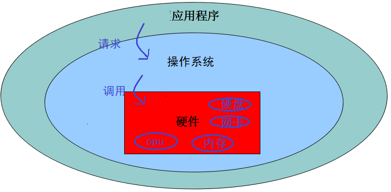

  * cpu轮训机制 ： cpu都在多个任务之间快速的切换执行，切换速度在微秒级别，其实cpu同时只执行一个任务，但是因为切换太快了，从应用层看好像所有任务同时在执行。

    

  * 多核CPU：现在的计算机一般都是多核CPU，比如四核，八核，我们可以理解为由多个单核CPU的集合。这时候在执行任务时就有了选择，可以将多个任务分配给某一个cpu核心，也可以将多个任务分配给多个cpu核心，操作系统会自动根据任务的复杂程度选择最优的分配方案。

    * 并发 ： 多个任务如果被分配给了一个cpu内核，那么这多个任务之间就是并发关系，并发关系的多个任务之间并不是真正的‘"同时"。
    * 并行 ： 多个任务如果被分配给了不同的cpu内核，那么这多个任务之间执行时就是并行关系，并行关系的多个任务时真正的“同时”执行。

  

* 什么是多任务编程

  多任务编程即一个程序中编写多个任务，在程序运行时让这多个任务一起运行，而不是一个一个的顺次执行。

  比如微信视频聊天，这时候在微信运行过程中既用到了视频任务也用到了音频任务，甚至同时还能发消息。这就是典型的多任务。而实际的开发过程中这样的情况比比皆是。

  

  

  * 实现多任务编程的方法 ： **多进程编程，多线程编程**

  

* 多任务意义

  * 提高了任务之间的配合，可以根据运行情况进行任务创建。

    比如： 你也不知道用户在微信使用中是否会进行视频聊天，总不能提前启动起来吧，这是需要根据用户的行为启动新任务。

  * 充分利用计算机资源，提高了任务的执行效率。

    * 在任务中无阻塞时只有并行状态才能提高效率

    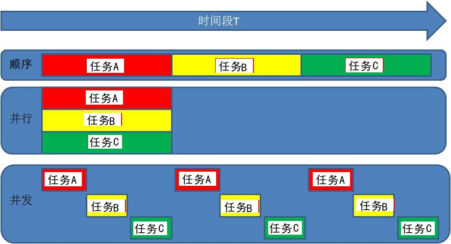

    

    * 在任务中有阻塞时并行并发都能提高效率

    


### 2.2 进程（Process）

#### 2.2.1 进程概述

* 定义： 程序在计算机中的一次执行过程。

  - 程序是一个可执行的文件，是静态的占有磁盘。

  - 进程是一个动态的过程描述，占有计算机运行资源，有一定的生命周期。

    

* 进程状态

   * 三态  
       	  就绪态 ： 进程具备执行条件，等待系统调度分配cpu资源 
      
           	  运行态 ： 进程占有cpu正在运行 
           	
           	  等待态 ： 进程阻塞等待，此时会让出cpu
      
      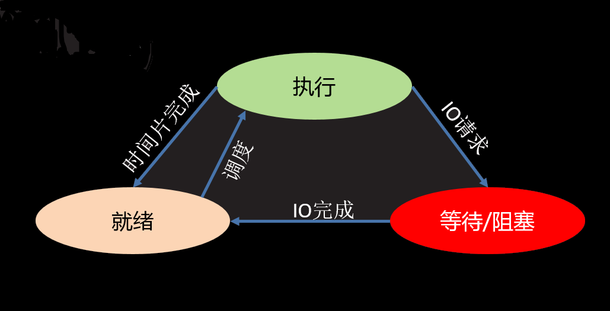
      
   * 五态 (在三态基础上增加新建和终止)
     
       	  新建 ： 创建一个进程，获取资源的过程
      
           	  终止 ： 进程结束，释放资源的过程
      
      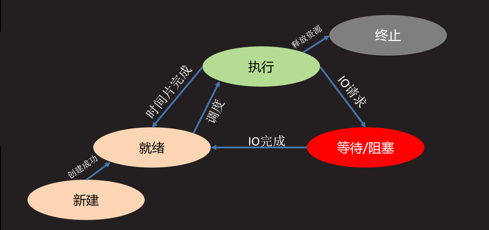


* 进程命令

  * 查看进程信息

    ```shell
    ps -aux
    ```

    

    * USER ： 进程的创建者
    * PID  :  操作系统分配给进程的编号,大于0的整数，系统中每个进程的PID都不重复。PID也是重要的区分进程的标志。
    * %CPU,%MEM : 占有的CPU和内存
    * STAT ： 进程状态信息，S I 表示阻塞状态  ，R 表示就绪状态或者运行状态
    * START : 进程启动时间
    * COMMAND : 通过什么程序启动的进程

  

  * 进程树形结构

    ```shell
    pstree
    ```

    * 父子进程：在Linux操作系统中，进程形成树形关系，任务上一级进程是下一级的父进程，下一级进程是上一级的子进程。

#### 2.2.2 多进程编程

* 使用模块 ： multiprocessing

* 创建流程
  
  【1】 将需要新进程执行的事件封装为函数
  
  【2】 通过模块的Process类创建进程对象，关联函数
  

【3】 可以通过进程对象设置进程信息及属性

【4】 通过进程对象调用start启动进程

  【5】 通过进程对象调用join回收进程资源

  

* 主要类和函数使用

```python
Process()
功能 ： 创建进程对象
参数 ： target 绑定要执行的目标函数 
	   args 元组，用于给target函数位置传参
	   kwargs 字典，给target函数键值传参
```

```python
p.start()
功能 ： 启动进程
```

> 注意 : 启动进程此时target绑定函数开始执行，该函数作为新进程执行内容，此时进程真正被创建

```python
p.join([timeout])
功能：阻塞等待回收进程
参数：超时时间
```


* 进程执行现象理解 （难点）
  
  
  
  * 新的进程是原有进程的子进程，子进程复制父进程全部内存空间代码段，一个进程可以创建多个子进程。
  * 子进程只执行指定的函数，其余内容均是父进程执行内容，但是子进程也拥有其他父进程资源。
  * 各个进程在执行上互不影响，也没有先后顺序关系。
  * 进程创建后，各个进程空间独立，相互没有影响。
  * multiprocessing 创建的子进程中无法使用标准输入（input）。


* 进程对象属性
  
  
  
  * p.name  进程名称
  * p.pid   对应子进程的PID号
  * p.is_alive() 查看子进程是否在生命周期
  * p.daemon  设置父子进程的退出关系  
    * 如果设置为True则该子进程会随父进程的退出而结束
    * 要求必须在start()前设置
    * 如果daemon设置成True 通常就不会使用 join()


#### 2.2.3 进程处理细节


* 进程相关函数

```
os.getpid()
功能： 获取一个进程的PID值
返回值： 返回当前进程的PID 
```

```
os.getppid()
功能： 获取父进程的PID号
返回值： 返回父进程PID
```

```
sys.exit(info)
功能：退出进程
参数：字符串 表示退出时打印内容
```


* 孤儿和僵尸

  * 孤儿进程 ： 父进程先于子进程退出，此时子进程成为孤儿进程。

    * 特点： 孤儿进程会被系统进程收养，此时系统进程就会成为孤儿进程新的父进程，孤儿进程退出该进程会自动处理。

  * 僵尸进程 ： 子进程先于父进程退出，父进程又没有处理子进程的退出状态，此时子进程就会成为僵尸进程。

    * 特点： 僵尸进程虽然结束，但是会存留部分进程信息资源在内存中，大量的僵尸进程会浪费系统的内存资源。

    * 如何避免僵尸进程产生

      1.  使用join()回收

      2.  在父进程中使用signal方法处理

         ```python
         from signal import *
         signal(SIGCHLD,SIG_IGN)
         ```

         

#### 2.2.5 创建进程类

进程的基本创建方法将子进程执行的内容封装为函数。如果我们更热衷于面向对象的编程思想，也可以使用类来封装进程内容。

* 创建步骤
  
  
  
  【1】 继承Process类
  
  【2】 重写`__init__`方法添加自己的属性，使用super()加载父类属性
  
  【3】 重写run()方法
  
* 使用方法
  
  
  
  【1】 实例化对象
  
  【2】 调用start自动执行run方法
  
  【3】 调用join回收进程


#### 2.2.4 进程池

* 必要性
  
  【1】 进程的创建和销毁过程消耗的资源较多
  
  【2】 当任务量众多，每个任务在很短时间内完成时，需要频繁的创建和销毁进程。此时对计算机压力较大
  
  【3】 进程池技术很好的解决了以上问题。
  
* 原理

  创建一定数量的进程来处理事件，事件处理完进	程不退出而是继续处理其他事件，直到所有事件全都处理完毕统一销毁。增加进程的重复利用，降低资源消耗。


* 进程池实现

1. 创建进程池对象，放入适当的进程

```python	  
from multiprocessing import Pool

Pool(processes)
功能： 创建进程池对象
参数： 指定进程数量，默认根据系统自动判定
```

2. 将事件加入进程池队列执行

```python
pool.apply_async(func,args,kwds)
功能: 使用进程池执行 func事件
参数： func 事件函数
      args 元组  给func按位置传参
      kwds 字典  给func按照键值传参
```

3. 关闭进程池

```python
pool.close()
功能： 关闭进程池
```

4. 回收进程池中进程

```python
pool.join()
功能： 回收进程池中进程
```


#### 2.2.5 进程通信

* 必要性： 进程间空间独立，资源不共享，此时在需要进程间数据传输时就需要特定的手段进行数据通信。
* 常用进程间通信方法：消息队列，套接字等。

* 消息队列使用
  * 通信原理： 在内存中开辟空间，建立队列模型，进程通过队列将消息存入，或者从队列取出完成进程间通信。
  * 实现方法

	```python
	from multiprocessing import Queue
	
	q = Queue(maxsize=0)
	功能: 创建队列对象
	参数：最多存放消息个数
	返回值：队列对象
	
	q.put(data,[block,timeout])
	功能：向队列存入消息
	参数：data  要存入的内容
		block  设置是否阻塞 False为非阻塞
		timeout  超时检测
	
	q.get([block,timeout])
	功能：从队列取出消息
	参数：block  设置是否阻塞 False为非阻塞
		 timeout  超时检测
	返回值： 返回获取到的内容
	
	q.full()   判断队列是否为满
	q.empty()  判断队列是否为空
	q.qsize()  获取队列中消息个数
	q.close()  关闭队列
	```


**群聊聊天室 **

> 功能 ： 类似qq群功能
>
> 
>
> 【1】 有人进入聊天室需要输入姓名，姓名不能重复
>
> 【2】 有人进入聊天室时，其他人会收到通知：xxx 进入了聊天室
>
> 【3】 一个人发消息，其他人会收到：xxx ： xxxxxxxxxxx
>
> 【4】 有人退出聊天室，则其他人也会收到通知:xxx退出了聊天室
>
> 【5】 扩展功能：服务器可以向所有用户发送公告:管理员消息： xxxxxxxxx
>
> 


### 2.3 线程 (Thread)


#### 2.3.1 线程概述

* 什么是线程
  
  
  
  【1】 线程被称为轻量级的进程，也是多任务编程方式
  

​       【2】 也可以利用计算机的多cpu资源

​       【3】 线程可以理解为进程中再开辟的分支任务

  

* 线程特征
  
  
  
  【1】 一个进程中可以包含多个线程
  
  【2】 线程也是一个运行行为，消耗计算机资源
  

​       【3】 一个进程中的所有线程共享这个进程的资源

​       【4】 多个线程之间的运行同样互不影响各自运行

​       【5】 线程的创建和销毁消耗资源远小于进程

  

  

#### 2.3.2 多线程编程

* 线程模块： threading


* 创建方法

  【1】 创建线程对象

```
from threading import Thread 

t = Thread()
功能：创建线程对象
参数：target 绑定线程函数
     args   元组 给线程函数位置传参
     kwargs 字典 给线程函数键值传参
```

​	【2】 启动线程

```
 t.start()
```

​	【3】 回收线程

```
 t.join([timeout])
```


* 线程对象属性
  * t.setName()  设置线程名称
  * t.getName()  获取线程名称
  * t.is_alive()  查看线程是否在生命周期
  * t.setDaemon()  设置daemon属性值
  * t.isDaemon()  查看daemon属性值
    * daemon为True时主线程退出分支线程也退出。要在start前设置，通常不和join一起使用。


#### 2.3.3 创建线程类

1. 创建步骤
   
   
   
   【1】 继承Thread类
   
   【2】 重写`__init__`方法添加自己的属性，使用super()加载父类属性
   
   【3】 重写run()方法
   
   
   
2. 使用方法

   

   【1】 实例化对象

   【2】 调用start自动执行run方法

   【3】 调用join回收线程


#### 2.3.4 线程同步互斥

* 线程通信方法： 线程间使用全局变量进行通信

* 共享资源争夺
  * 共享资源：多个进程或者线程都可以操作的资源称为共享资源。对共享资源的操作代码段称为临界区。
  * 影响 ： 对共享资源的无序操作可能会带来数据的混乱，或者操作错误。此时往往需要同步互斥机制协调操作顺序。

* 同步互斥机制

  * 同步 ： 同步是一种协作关系，为完成操作，多进程或者线程间形成一种协调，按照必要的步骤有序执行操作。

    

  * 互斥 ： 互斥是一种制约关系，当一个进程或者线程占有资源时会进行加锁处理，此时其他进程线程就无法操作该资源，直到解锁后才能操作。


* 线程Event

```python		  
from threading import Event

e = Event()  创建线程event对象

e.wait([timeout])  阻塞等待e被set

e.set()  设置e，使wait结束阻塞

e.clear() 使e回到未被设置状态

e.is_set()  查看当前e是否被设置
```


* 线程锁 Lock

```python
from  threading import Lock

lock = Lock()  创建锁对象
lock.acquire() 上锁  如果lock已经上锁再调用会阻塞
lock.release() 解锁

with  lock:  上锁
...
...
	 with代码块结束自动解锁
```


#### 2.3.5 死锁

* 什么是死锁

  死锁是指两个或两个以上的线程在执行过程中，由于竞争资源或者由于彼此通信而造成的一种阻塞的现象，若无外力作用，它们都将无法推进下去。此时称系统处于死锁状态或系统产生了死锁。

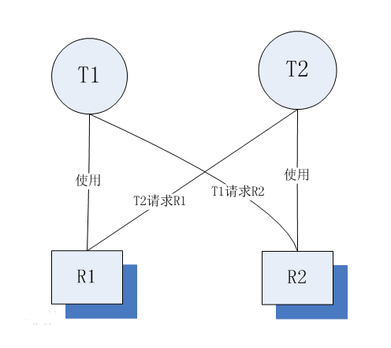

* 死锁产生条件

  * 互斥条件：指线程使用了互斥方法，使用一个资源时其他线程无法使用。

  * 请求和保持条件：指线程已经保持至少一个资源，但又提出了新的资源请求，在获取到新的资源前不会释放自己保持的资源。

  * 不剥夺条件：不会受到线程外部的干扰，如系统强制终止线程等。

  * 环路等待条件：指在发生死锁时，必然存在一个线程——资源的环形链，如 T0正在等待一个T1占用的资源；T1正在等待T2占用的资源，……，Tn正在等待已被T0占用的资源。

    

* 如何避免死锁
  * 逻辑清晰，不要同时出现上述死锁产生的四个条件
  * 通过测试工程师进行死锁检测


#### 2.3.6 GIL问题

* 什么是GIL问题 （全局解释器锁）

  由于python解释器设计中加入了解释器锁，导致python解释器同一时刻只能解释执行一个线程，大大降低了线程的执行效率。


* 导致后果
  因为遇到阻塞时线程会主动让出解释器，去解释其他线程。所以python多线程在执行多阻塞任务时可以提升程序效率，其他情况并不能对效率有所提升。
  
  
  
* GIL问题建议


    * 尽量使用进程完成无阻塞的并发行为
    
    * 不使用c作为解释器 （Java  C#）
    
     Guido的声明：<http://www.artima.com/forums/flat.jsp?forum=106&thread=214235>


* 结论 
  * GIL问题与Python语言本身并没什么关系，属于解释器设计的历史问题。
  * 在无阻塞状态下，多线程程序程序执行效率并不高，甚至还不如单线程效率。
  * Python多线程只适用于执行有阻塞延迟的任务情形。


#### 2.3.7 进程线程的区别联系

* 区别联系

1. 两者都是多任务编程方式，都能使用计算机多核资源
2. 进程的创建删除消耗的计算机资源比线程多
3. 进程空间独立，数据互不干扰，有专门通信方法；线程使用全局变量通信
4. 一个进程可以有多个分支线程，两者有包含关系
5. 多个线程共享进程资源，在共享资源操作时往往需要同步互斥处理
6. Python线程存在GIL问题，但是进程没有。

* 使用场景

  

1. 任务场景：一个大型服务，往往包含多个独立的任务模块，每个任务模块又有多个小独立任务构成，此时整个项目可能有多个进程，每个进程又有多个线程。
3. 编程语言：Java,C#之类的编程语言在执行多任务时一般都是用线程完成，因为线程资源消耗少；而Python由于GIL问题往往使用多进程。


## 3. 网络并发模型


### 3.1 网络并发模型概述

* 什么是网络并发

  在实际工作中，一个服务端程序往往要应对多个客户端同时发起访问的情况。如果让服务端程序能够更好的同时满足更多客户端网络请求的情形，这就是并发网络模型。

  

* 循环网络模型问题

  循环网络模型只能循环接收客户端请求，处理请求。同一时刻只能处理一个请求，处理完毕后再处理下一个。这样的网络模型虽然简单，资源占用不多，但是无法同时处理多个客户端请求就是其最大的弊端，往往只有在一些低频的小请求任务中才会使用。


### 3.2 多任务并发模型

多任务并发模型具体指多进程多线程网络并发模型，即每当一个客户端连接服务器，就创建一个新的进程/线程为该客户端服务，客户端退出时再销毁该进程/线程，多任务并发模型也是实际工作中最为常用的服务端处理模型。


* 优点：能同时满足多个客户端长期占有服务端需求，可以处理各种请求。
* 缺点： 资源消耗较大
* 适用情况：客户端请求较复杂，需要长时间占有服务器。

#### 3.1.1 多进程并发模型

* 创建网络套接字用于接收客户端请求
* 等待客户端连接
* 客户端连接，则创建新的进程具体处理客户端请求
* 主进程继续等待其他客户端连接
* 如果客户端退出，则销毁对应的进程


#### 3.1.2 多线程并发模型

- 创建网络套接字用于接收客户端请求
- 等待客户端连接
- 客户端连接，则创建新的线程具体处理客户端请求
- 主线程继续等待其他客户端连接
- 如果客户端退出，则销毁对应的线程


**ftp 文件服务器**


【1】 分为服务端和客户端，要求可以有多个客户端同时操作。

【2】 客户端可以查看服务器文件库中有什么文件。

【3】 客户端可以从文件库中下载文件到本地。

【4】 客户端可以上传一个本地文件到文件库。

【5】 使用print在客户端打印命令输入提示，引导操作


### 3.3 IO并发模型


#### 3.2.1 IO概述

* 什么是IO

  在程序中存在读写数据操作行为的事件均是IO行为，比如终端输入输出 ,文件读写，数据库修改和网络消息收发等。

* 程序分类
  * IO密集型程序：在程序执行中有大量IO操作，而运算操作较少。消耗cpu较少，耗时长。
  * 计算密集型程序：程序运行中运算较多，IO操作相对较少。cpu消耗多，执行速度快，几乎没有阻塞。
  
* IO分类：阻塞IO ，非阻塞IO，IO多路复用，异步IO等。

  

#### 3.2.2 阻塞IO

  * 定义：在执行IO操作时如果执行条件不满足则阻塞。阻塞IO是IO的默认形态。
  * 效率：阻塞IO效率很低。但是由于逻辑简单所以是默认IO行为。
  * 阻塞情况
    * 因为某种执行条件没有满足造成的函数阻塞
      e.g.  accept   input   recv
    * 处理IO的时间较长产生的阻塞状态
      e.g. 网络传输，大文件读写


#### 3.2.3 非阻塞IO 

* 定义 ：通过修改IO属性行为，使原本阻塞的IO变为非阻塞的状态。

- 设置套接字为非阻塞IO

	```
	sockfd.setblocking(bool)
	功能：设置套接字为非阻塞IO
	参数：默认为True，表示套接字IO阻塞；设置为False则套接字IO变为非阻塞
	```


- 超时检测 ：设置一个最长阻塞时间，超过该时间后则不再阻塞等待。

  ```
  sockfd.settimeout(sec)
  功能：设置套接字的超时时间
  参数：设置的时间
  ```

  

#### 3.2.4 IO多路复用

* 定义

  同时监控多个IO事件，当哪个IO事件准备就绪就执行哪个IO事件。以此形成可以同时处理多个IO的行为，避免一个IO阻塞造成其他IO均无法执行，提高了IO执行效率。

* 具体方案
  * select方法 ： windows  linux  unix
  * poll方法： linux  unix
  * epoll方法： linux


* select 方法

```python
rs, ws, xs=select(rlist, wlist, xlist[, timeout])
功能: 监控IO事件，阻塞等待IO发生
参数：rlist  列表  读IO列表，添加等待发生的或者可读的IO事件
      wlist  列表  写IO列表，存放要可以主动处理的或者可写的IO事件
      xlist  列表 异常IO列表，存放出现异常要处理的IO事件
      timeout  超时时间

返回值： rs 列表  rlist中准备就绪的IO
        ws 列表  wlist中准备就绪的IO
	   xs 列表  xlist中准备就绪的IO
```


* poll方法

```python
p = select.poll()
功能 ： 创建poll对象
返回值： poll对象
```

```python	
p.register(fd,event)   
功能: 注册关注的IO事件
参数：fd  要关注的IO
      event  要关注的IO事件类型
  	     常用类型：POLLIN  读IO事件（rlist）
		      POLLOUT 写IO事件 (wlist)
		      POLLERR 异常IO  （xlist）
		      POLLHUP 断开连接 
		  e.g. p.register(sockfd,POLLIN|POLLERR)

p.unregister(fd)
功能：取消对IO的关注
参数：IO对象或者IO对象的fileno
```

```python
events = p.poll()
功能： 阻塞等待监控的IO事件发生
返回值： 返回发生的IO
        events格式  [(fileno,event),()....]
        每个元组为一个就绪IO，元组第一项是该IO的fileno，第二项为该IO就绪的事件类型
```


* epoll方法

  使用方法 ： 基本与poll相同

  生成对象改为 epoll()

  将所有事件类型改为EPOLL类型

  

  * epoll特点
    * epoll 效率比select poll要高
    * epoll 监控IO数量比select要多
    * epoll 的触发方式比poll要多 （EPOLLET边缘触发）


#### 3.2.5 IO并发模型

利用IO多路复用等技术，同时处理多个客户端IO请求。

* 优点 ： 资源消耗少，能同时高效处理多个IO行为
* 缺点 ： 只针对处理并发产生的IO事件
* 适用情况：HTTP请求，网络传输等都是IO行为，可以通过IO多路复用监控多个客户端的IO请求。


* 并发服务实现过程

  【1】将关注的IO准备好，通常设置为非阻塞状态。
  
  【2】通过IO多路复用方法提交，进行IO监控。
  
  【3】阻塞等待，当监控的IO有发生时，结束阻塞。
  
  【4】遍历返回值列表，确定就绪IO事件。
  
  【5】处理发生的IO事件。
  
  【6】继续循环监控IO发生。


## 4. web服务

### 4.1 HTTP协议

#### 4.1.1 协议概述

* 用途 ： 网页获取，数据的传输
* 特点
  * 应用层协议，使用tcp进行数据传输
  * 简单，灵活，很多语言都有HTTP专门接口
  * 无状态，数据传输过程中不记录传输内容
  * 有丰富了请求类型
  * 可以传输的数据类型众多


#### 4.1.2 网页访问流程

1. 客户端（浏览器）通过tcp传输，发送http请求给服务端
2. 服务端接收到http请求后进行解析
3. 服务端处理请求内容，组织响应内容
4. 服务端将响应内容以http响应格式发送给浏览器
5. 浏览器接收到响应内容，解析展示


#### 4.1.2 HTTP请求

- 请求行 ： 具体的请求类别和请求内容

```
	GET         /        HTTP/1.1
	请求类别   请求内容     协议版本
```

​		  请求类别：每个请求类别表示要做不同的事情 

```
		GET : 获取网络资源
		POST ：提交一定的信息，得到反馈
		HEAD ： 只获取网络资源的响应头
		PUT ： 更新服务器资源
		DELETE ： 删除服务器资源
```

- 请求头：对请求的进一步解释和描述

```
Accept-Encoding: gzip
```

- 空行
- 请求体: 请求参数或者提交内容

 

#### 4.1.3 HTTP响应

- 响应行 ： 反馈基本的响应情况

```
HTTP/1.1     200       OK
版本信息    响应码   附加信息
```

​	响应码 ： 

```
1xx  提示信息，表示请求被接收
2xx  响应成功
3xx  响应需要进一步操作，重定向
4xx  客户端错误
5xx  服务器错误
```

- 响应头：对响应内容的描述

```
Content-Type: text/html
Content-Length:109\r\n
```

- 空行
- 响应体：响应的主体内容信息


### 4.2 web 服务程序实现


  1. 主要功能 ：
	  	
	【1】 接收客户端（浏览器）请求
	
	【2】 解析客户端发送的请求
	
	【3】 根据请求组织数据内容
	
	【4】 将数据内容形成http响应格式返回给浏览器
	
  2. 特点 ：

        【1】 采用IO并发，可以满足多个客户端同时发起请求情况

        【2】 通过类接口形式进行功能封装

        【3】 做基本的请求解析，根据具体请求返回具体内容，同时可以满足客户端的网页效果加载


## 并发技术探讨（扩展）

### 高并发问题

* 衡量高并发的关键指标

  - 响应时间(Response Time) ： 接收请求后处理的时间

  - 吞吐量(Throughput)： 响应时间+QPS+同时在线用户数量

  - 每秒查询率QPS(Query Per Second)： 每秒接收请求的次数

  - 每秒事务处理量TPS(Transaction Per Second)：每秒处理请求的次数（包含接收，处理，响应）

  - 同时在线用户数量：同时连接服务器的用户的数量

* 多大的并发量算是高并发

  * 没有最高，只要更高

    比如在一个小公司可能QPS2000+就不错了，在一个需要频繁访问的门户网站可能要达到QPS5W+

  * C10K问题

    早先服务器都是单纯基于进程/线程模型的，新到来一个TCP连接，就需要分配1个进程（或者线程）。而进程占用操作系统资源多，一台机器无法创建很多进程。如果是C10K就要创建1万个进程，那么单机而言操作系统是无法承受的，这就是著名的C10k问题。创建的进程线程多了，数据拷贝频繁， 进程/线程切换消耗大， 导致操作系统崩溃，这就是C10K问题的本质！

### 更高并发的实现

​		为了解决C10K问题，现在高并发的实现已经是一个更加综合的架构艺术。涉及到进程线程编程，IO处理，数据库处理，缓存，队列，负载均衡等等，这些我们在后面的阶段还会学习。此外还有硬件的设计，服务器集群的部署，服务器负载，网络流量的处理等。


实际工作中，应对更庞大的任务场景，网络并发模型的使用有时也并不单一。比如多进程网络并发中每个进程再开辟线程，或者在每个进程中也可以使用多路复用的IO处理方法。

​	